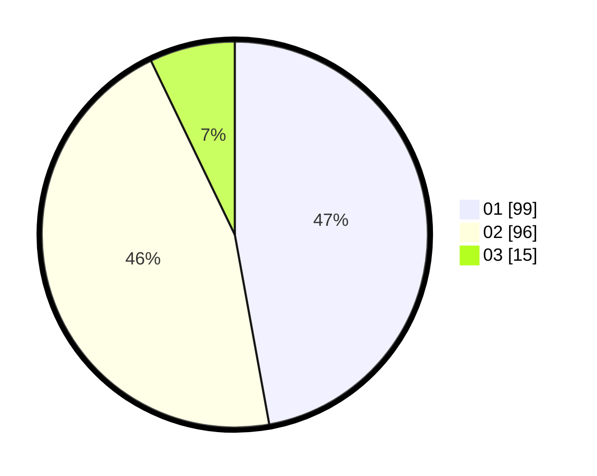

# Hasil

Hasil perolehan suara paslon dapat dilihat pada file paslon-01.txt, paslon-02.txt, dan paslon-03.txt.

Jika tidak ada, artinya data tersebut belum ada pada SIREKAP.

## Perolehan Suara

 * Paslon 01: **99**.
 * Paslon 02: **96**.
 * Paslon 03: **15**.

## Foto C Plano

https://sirekap-obj-formc.kpu.go.id/5b89/pemilu/ppwp/31/75/05/10/02/3175051002021-20240214-190235--8910f0e4-1c2b-4364-8ccc-67515512ff9c.jpg

https://sirekap-obj-formc.kpu.go.id/5b89/pemilu/ppwp/31/75/05/10/02/3175051002021-20240214-190413--94b6ff5b-b912-4046-8804-26746e038d84.jpg

https://sirekap-obj-formc.kpu.go.id/5b89/pemilu/ppwp/31/75/05/10/02/3175051002021-20240215-102948--0c8b4d89-2b5c-46ff-9520-fb27608bbb93.jpg

## DATA PEMILIH TETAP

Jumlah pemilih dalam DPT: **267**.
 * L: **130**.
 * P: **137**.

## DATA PENGGUNA HAK PILIH

Jumlah pengguna hak pilih dalam DPT: **209**.
 * L: **93**.
 * P: **116**.

Jumlah pengguna hak pilih dalam DPTb: **2**.
 * L: **1**.
 * P: **1**.

Jumlah pengguna hak pilih dalam DPK: **1**.
 * L: **1**.
 * P: **0**.

Jumlah pengguna hak pilih: **212**.
 * L: **95**.
 * P: **117**.

## JUMLAH SUARA SAH DAN TIDAK SAH

JUMLAH SELURUH SUARA SAH: **210**.

JUMLAH SUARA TIDAK SAH: **2**.

JUMLAH SELURUH SUARA SAH DAN SUARA TIDAK SAH: **212**.
