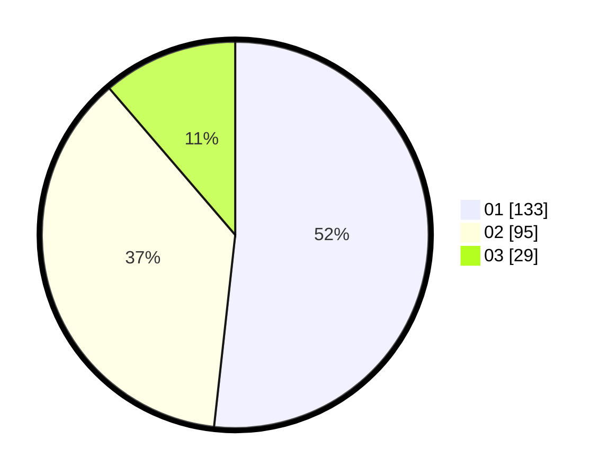

# Hasil

Hasil perolehan suara paslon dapat dilihat pada file paslon-01.txt, paslon-02.txt, dan paslon-03.txt.

Jika tidak ada, artinya data tersebut belum ada pada SIREKAP.

## Perolehan Suara

 * Paslon 01: **133**.
 * Paslon 02: **95**.
 * Paslon 03: **29**.

## Foto C Plano

https://sirekap-obj-formc.kpu.go.id/0f1e/pemilu/ppwp/31/75/05/10/02/3175051002026-20240215-011051--f139b287-ca7d-4f29-866e-583dd814cb15.jpg

https://sirekap-obj-formc.kpu.go.id/0f1e/pemilu/ppwp/31/75/05/10/02/3175051002026-20240214-205639--7c2d6789-10b3-4f62-aa3c-b2934c109c9f.jpg

https://sirekap-obj-formc.kpu.go.id/0f1e/pemilu/ppwp/31/75/05/10/02/3175051002026-20240214-205703--b1dccda8-d7df-4f8f-9c08-d6488f585465.jpg
