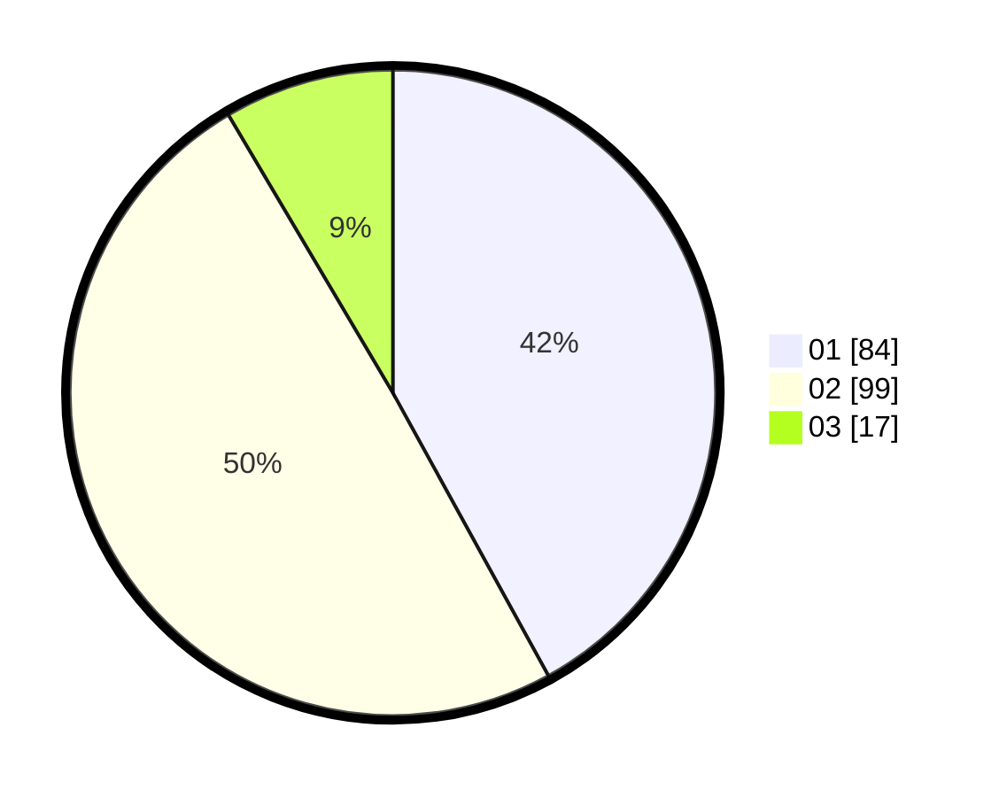

# Hasil

Hasil perolehan suara paslon dapat dilihat pada file paslon-01.txt, paslon-02.txt, dan paslon-03.txt.

Jika tidak ada, artinya data tersebut belum ada pada SIREKAP.

## Perolehan Suara

 * Paslon 01: **84**.
 * Paslon 02: **99**.
 * Paslon 03: **17**.

## Foto C Plano

https://sirekap-obj-formc.kpu.go.id/47c5/pemilu/ppwp/31/75/05/10/02/3175051002027-20240214-184425--ad158431-a7a2-45c2-98eb-3ce27242f4a0.jpg

https://sirekap-obj-formc.kpu.go.id/47c5/pemilu/ppwp/31/75/05/10/02/3175051002027-20240214-184845--bf676180-e9b1-4d4d-b3cb-5dcacee2ff6f.jpg

https://sirekap-obj-formc.kpu.go.id/47c5/pemilu/ppwp/31/75/05/10/02/3175051002027-20240214-184651--23cc7c7e-c6e0-4090-b1c2-dbd2e1c49e0a.jpg

## DATA PEMILIH TETAP

Jumlah pemilih dalam DPT: **279**.
 * L: **135**.
 * P: **144**.

## DATA PENGGUNA HAK PILIH

Jumlah pengguna hak pilih dalam DPT: **194**.
 * L: **90**.
 * P: **104**.

Jumlah pengguna hak pilih dalam DPTb: **1**.
 * L: **1**.
 * P: **0**.

Jumlah pengguna hak pilih dalam DPK: **6**.
 * L: **3**.
 * P: **3**.

Jumlah pengguna hak pilih: **201**.
 * L: **94**.
 * P: **107**.

## JUMLAH SUARA SAH DAN TIDAK SAH

JUMLAH SELURUH SUARA SAH: **200**.

JUMLAH SUARA TIDAK SAH: **1**.

JUMLAH SELURUH SUARA SAH DAN SUARA TIDAK SAH: **201**.
