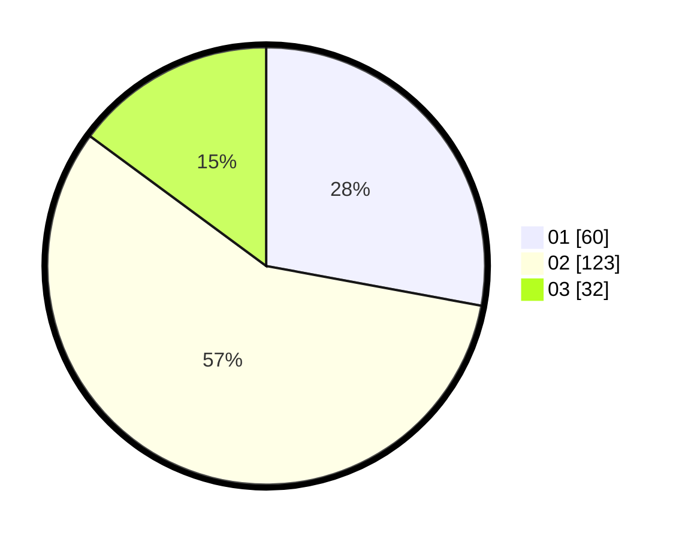

# Hasil

Hasil perolehan suara paslon dapat dilihat pada file paslon-01.txt, paslon-02.txt, dan paslon-03.txt.

Jika tidak ada, artinya data tersebut belum ada pada SIREKAP.

## Perolehan Suara

 * Paslon 01: **60**.
 * Paslon 02: **123**.
 * Paslon 03: **32**.

## Foto C Plano

https://sirekap-obj-formc.kpu.go.id/208b/pemilu/ppwp/31/75/05/10/02/3175051002032-20240214-213713--1bea19c8-25fa-478f-93b9-dc045b497ad6.jpg

https://sirekap-obj-formc.kpu.go.id/208b/pemilu/ppwp/31/75/05/10/02/3175051002032-20240214-193157--59248eea-a447-4c1b-96c6-0dea8556818e.jpg

https://sirekap-obj-formc.kpu.go.id/208b/pemilu/ppwp/31/75/05/10/02/3175051002032-20240214-193216--f8871386-9f21-489f-905f-6fd3c50f9e7d.jpg

## DATA PEMILIH TETAP

Jumlah pemilih dalam DPT: **263**.
 * L: **122**.
 * P: **141**.

## DATA PENGGUNA HAK PILIH

Jumlah pengguna hak pilih dalam DPT: **212**.
 * L: **96**.
 * P: **116**.

Jumlah pengguna hak pilih dalam DPTb: **1**.
 * L: **0**.
 * P: **1**.

Jumlah pengguna hak pilih dalam DPK: **6**.
 * L: **3**.
 * P: **3**.

Jumlah pengguna hak pilih: **219**.
 * L: **99**.
 * P: **120**.

## JUMLAH SUARA SAH DAN TIDAK SAH

JUMLAH SELURUH SUARA SAH: **215**.

JUMLAH SUARA TIDAK SAH: **4**.

JUMLAH SELURUH SUARA SAH DAN SUARA TIDAK SAH: **219**.
