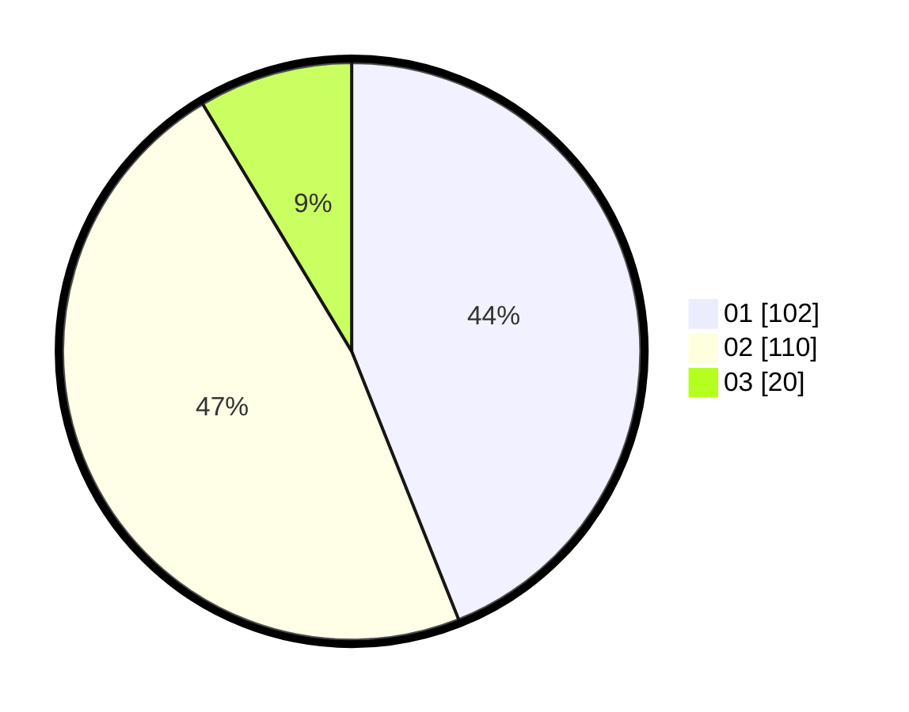

# Hasil

Hasil perolehan suara paslon dapat dilihat pada file paslon-01.txt, paslon-02.txt, dan paslon-03.txt.

Jika tidak ada, artinya data tersebut belum ada pada SIREKAP.

## Perolehan Suara

 * Paslon 01: **102**.
 * Paslon 02: **110**.
 * Paslon 03: **20**.

## Foto C Plano

https://sirekap-obj-formc.kpu.go.id/7659/pemilu/ppwp/31/75/05/10/02/3175051002040-20240214-155604--6b00d6ba-7edb-436d-adf7-666b22b782ab.jpg

https://sirekap-obj-formc.kpu.go.id/7659/pemilu/ppwp/31/75/05/10/02/3175051002040-20240214-155701--939459f5-7aaa-4019-b6c4-bbc891c9391a.jpg

https://sirekap-obj-formc.kpu.go.id/7659/pemilu/ppwp/31/75/05/10/02/3175051002040-20240214-160105--3ecea068-aa2c-4074-aa79-bcca757e0c43.jpg

## DATA PEMILIH TETAP

Jumlah pemilih dalam DPT: **284**.
 * L: **129**.
 * P: **155**.

## DATA PENGGUNA HAK PILIH

Jumlah pengguna hak pilih dalam DPT: **236**.
 * L: **107**.
 * P: **129**.

Jumlah pengguna hak pilih dalam DPTb: **0**.
 * L: **0**.
 * P: **0**.

Jumlah pengguna hak pilih dalam DPK: **0**.
 * L: **0**.
 * P: **0**.

Jumlah pengguna hak pilih: **236**.
 * L: **107**.
 * P: **129**.

## JUMLAH SUARA SAH DAN TIDAK SAH

JUMLAH SELURUH SUARA SAH: **232**.

JUMLAH SUARA TIDAK SAH: **4**.

JUMLAH SELURUH SUARA SAH DAN SUARA TIDAK SAH: **236**.
