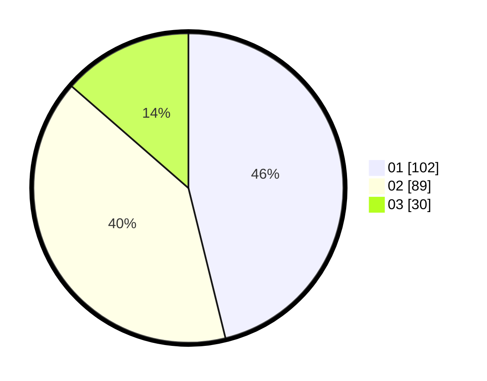

# Hasil

Hasil perolehan suara paslon dapat dilihat pada file paslon-01.txt, paslon-02.txt, dan paslon-03.txt.

Jika tidak ada, artinya data tersebut belum ada pada SIREKAP.

## Perolehan Suara

 * Paslon 01: **102**.
 * Paslon 02: **89**.
 * Paslon 03: **30**.

## Foto C Plano

https://sirekap-obj-formc.kpu.go.id/c2a5/pemilu/ppwp/31/75/05/10/02/3175051002043-20240215-213646--2c7f66ae-b90f-47e7-9ac2-709899b2bdaa.jpg

https://sirekap-obj-formc.kpu.go.id/c2a5/pemilu/ppwp/31/75/05/10/02/3175051002043-20240214-155017--e8d9e3b0-1380-47ad-b7cc-ba7277111da5.jpg

https://sirekap-obj-formc.kpu.go.id/c2a5/pemilu/ppwp/31/75/05/10/02/3175051002043-20240215-213646--c312e74a-31be-4abb-bb93-ca0039064d3d.jpg

## DATA PEMILIH TETAP

Jumlah pemilih dalam DPT: **265**.
 * L: **139**.
 * P: **126**.

## DATA PENGGUNA HAK PILIH

Jumlah pengguna hak pilih dalam DPT: **224**.
 * L: **113**.
 * P: **111**.

Jumlah pengguna hak pilih dalam DPTb: **0**.
 * L: **0**.
 * P: **0**.

Jumlah pengguna hak pilih dalam DPK: **2**.
 * L: **0**.
 * P: **2**.

Jumlah pengguna hak pilih: **226**.
 * L: **113**.
 * P: **113**.

## JUMLAH SUARA SAH DAN TIDAK SAH

JUMLAH SELURUH SUARA SAH: **221**.

JUMLAH SUARA TIDAK SAH: **5**.

JUMLAH SELURUH SUARA SAH DAN SUARA TIDAK SAH: **226**.
