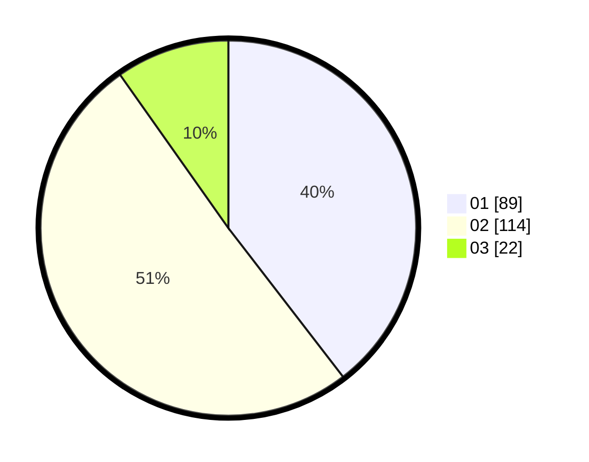

# Hasil

Hasil perolehan suara paslon dapat dilihat pada file paslon-01.txt, paslon-02.txt, dan paslon-03.txt.

Jika tidak ada, artinya data tersebut belum ada pada SIREKAP.

## Perolehan Suara

 * Paslon 01: **89**.
 * Paslon 02: **114**.
 * Paslon 03: **22**.

## Foto C Plano

https://sirekap-obj-formc.kpu.go.id/9365/pemilu/ppwp/31/75/05/10/02/3175051002051-20240214-205451--b7bdb54e-ce23-4b90-b5c6-55da115df296.jpg

https://sirekap-obj-formc.kpu.go.id/9365/pemilu/ppwp/31/75/05/10/02/3175051002051-20240214-205502--f489f43f-ec49-4685-a898-75bd21bb7fe2.jpg

https://sirekap-obj-formc.kpu.go.id/9365/pemilu/ppwp/31/75/05/10/02/3175051002051-20240214-205511--c4c41628-c255-4f6f-be1e-28abb867f996.jpg

## DATA PEMILIH TETAP

Jumlah pemilih dalam DPT: **265**.
 * L: **136**.
 * P: **129**.

## DATA PENGGUNA HAK PILIH

Jumlah pengguna hak pilih dalam DPT: **265**.
 * L: **136**.
 * P: **129**.

Jumlah pengguna hak pilih dalam DPTb: **0**.
 * L: **0**.
 * P: **0**.

Jumlah pengguna hak pilih dalam DPK: **0**.
 * L: **0**.
 * P: **0**.

Jumlah pengguna hak pilih: **227**.
 * L: **112**.
 * P: **115**.

## JUMLAH SUARA SAH DAN TIDAK SAH

JUMLAH SELURUH SUARA SAH: **225**.

JUMLAH SUARA TIDAK SAH: **2**.

JUMLAH SELURUH SUARA SAH DAN SUARA TIDAK SAH: **227**.
