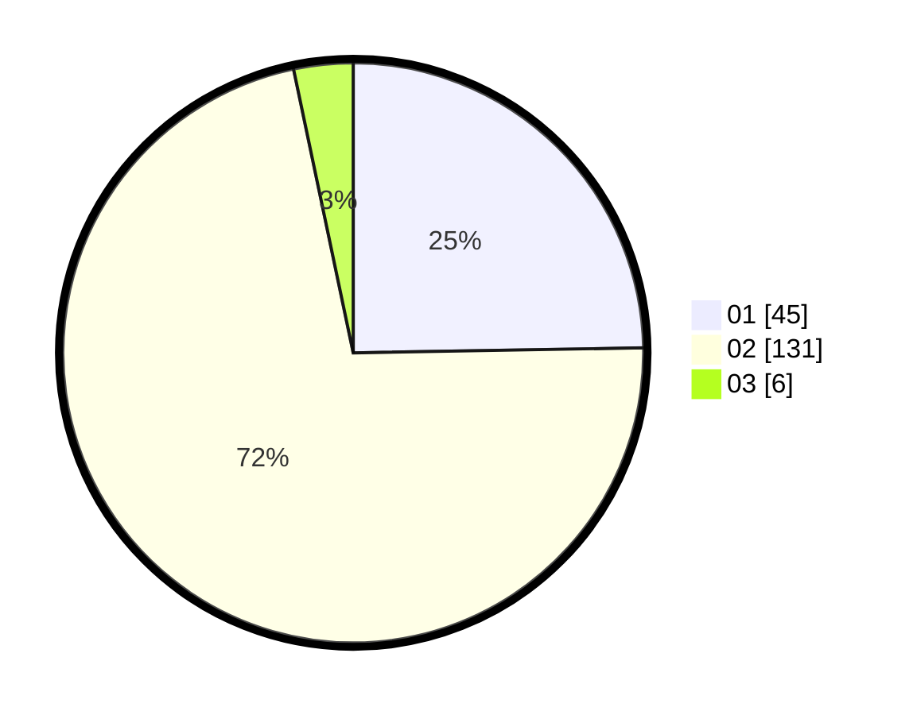

# Hasil

Hasil perolehan suara paslon dapat dilihat pada file paslon-01.txt, paslon-02.txt, dan paslon-03.txt.

Jika tidak ada, artinya data tersebut belum ada pada SIREKAP.

## Perolehan Suara

 * Paslon 01: **45**.
 * Paslon 02: **131**.
 * Paslon 03: **6**.

## Foto C Plano

https://sirekap-obj-formc.kpu.go.id/d0d9/pemilu/ppwp/31/75/05/10/02/3175051002061-20240214-155420--2e9401a1-9d73-4630-8bbb-b0fb051fe88f.jpg

https://sirekap-obj-formc.kpu.go.id/d0d9/pemilu/ppwp/31/75/05/10/02/3175051002061-20240214-160115--f98a92c0-441c-4e13-b2ae-3ca8a3ab1dd7.jpg

https://sirekap-obj-formc.kpu.go.id/d0d9/pemilu/ppwp/31/75/05/10/02/3175051002061-20240214-155639--3c21aa3f-1d4d-400e-b027-1dc9682637cc.jpg

## DATA PEMILIH TETAP

Jumlah pemilih dalam DPT: **247**.
 * L: **76**.
 * P: **171**.

## DATA PENGGUNA HAK PILIH

Jumlah pengguna hak pilih dalam DPT: **174**.
 * L: **47**.
 * P: **127**.

Jumlah pengguna hak pilih dalam DPTb: **1**.
 * L: **1**.
 * P: **0**.

Jumlah pengguna hak pilih dalam DPK: **9**.
 * L: **2**.
 * P: **7**.

Jumlah pengguna hak pilih: **184**.
 * L: **50**.
 * P: **134**.

## JUMLAH SUARA SAH DAN TIDAK SAH

JUMLAH SELURUH SUARA SAH: **182**.

JUMLAH SUARA TIDAK SAH: **2**.

JUMLAH SELURUH SUARA SAH DAN SUARA TIDAK SAH: **184**.
