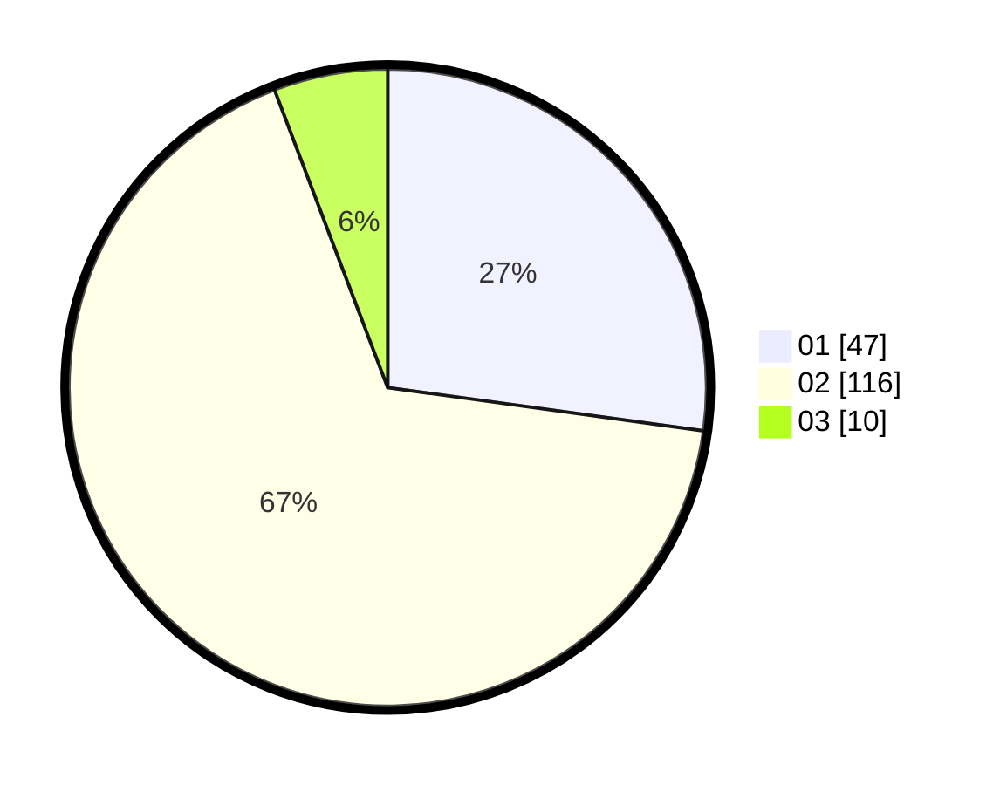

# Hasil

Hasil perolehan suara paslon dapat dilihat pada file paslon-01.txt, paslon-02.txt, dan paslon-03.txt.

Jika tidak ada, artinya data tersebut belum ada pada SIREKAP.

## Perolehan Suara

 * Paslon 01: **47**.
 * Paslon 02: **116**.
 * Paslon 03: **10**.

## Foto C Plano

https://sirekap-obj-formc.kpu.go.id/98f8/pemilu/ppwp/31/75/05/10/02/3175051002069-20240214-234357--13c7812c-e924-429f-9f15-930686e418f1.jpg

https://sirekap-obj-formc.kpu.go.id/98f8/pemilu/ppwp/31/75/05/10/02/3175051002069-20240214-201127--5119fe35-ce2e-445d-9468-31bbe4d81bda.jpg

https://sirekap-obj-formc.kpu.go.id/98f8/pemilu/ppwp/31/75/05/10/02/3175051002069-20240214-201513--43aaf9a1-9175-4abb-8f3e-2d4850c158ff.jpg

## DATA PEMILIH TETAP

Jumlah pemilih dalam DPT: **246**.
 * L: **89**.
 * P: **157**.

## DATA PENGGUNA HAK PILIH

Jumlah pengguna hak pilih dalam DPT: **165**.
 * L: **53**.
 * P: **112**.

Jumlah pengguna hak pilih dalam DPTb: **0**.
 * L: **0**.
 * P: **0**.

Jumlah pengguna hak pilih dalam DPK: **9**.
 * L: **5**.
 * P: **4**.

Jumlah pengguna hak pilih: **174**.
 * L: **58**.
 * P: **116**.

## JUMLAH SUARA SAH DAN TIDAK SAH

JUMLAH SELURUH SUARA SAH: **173**.

JUMLAH SUARA TIDAK SAH: **1**.

JUMLAH SELURUH SUARA SAH DAN SUARA TIDAK SAH: **174**.
