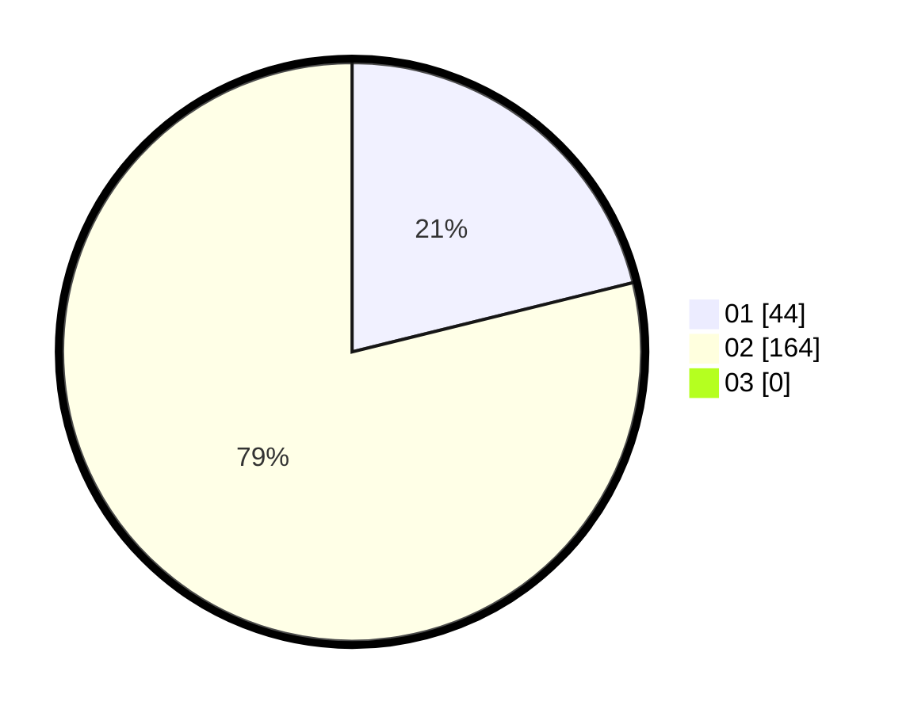

# Hasil

Hasil perolehan suara paslon dapat dilihat pada file paslon-01.txt, paslon-02.txt, dan paslon-03.txt.

Jika tidak ada, artinya data tersebut belum ada pada SIREKAP.

## Perolehan Suara

 * Paslon 01: **44**.
 * Paslon 02: **164**.
 * Paslon 03: **0**.

## Foto C Plano

https://sirekap-obj-formc.kpu.go.id/d48a/pemilu/ppwp/31/75/05/10/02/3175051002072-20240214-204650--f40f77e1-9ef1-4c40-bb92-aba5d1072b4d.jpg

https://sirekap-obj-formc.kpu.go.id/d48a/pemilu/ppwp/31/75/05/10/02/3175051002072-20240214-214209--227241b4-c0f0-4b53-8aec-ac6eecd5cbb2.jpg

https://sirekap-obj-formc.kpu.go.id/d48a/pemilu/ppwp/31/75/05/10/02/3175051002072-20240214-214106--8a04f2b5-fc8b-4296-9bad-1ec694b11592.jpg
