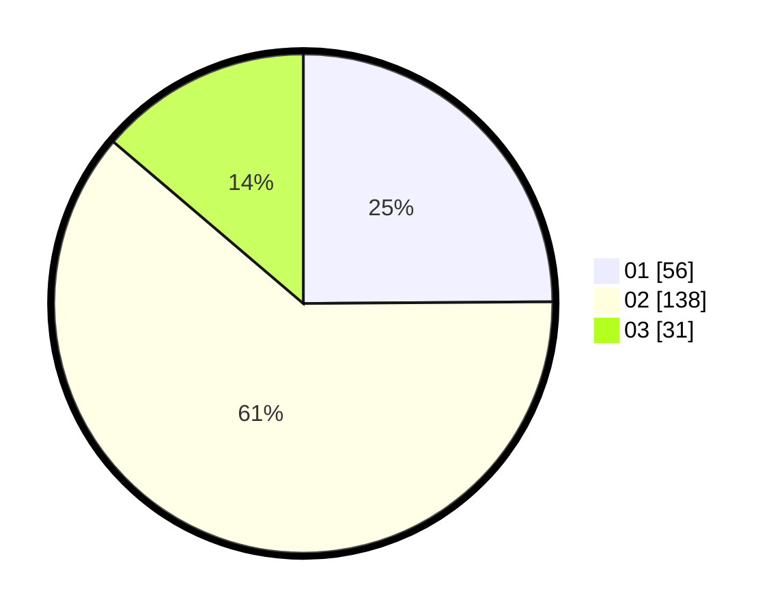

# Hasil

Hasil perolehan suara paslon dapat dilihat pada file paslon-01.txt, paslon-02.txt, dan paslon-03.txt.

Jika tidak ada, artinya data tersebut belum ada pada SIREKAP.

## Perolehan Suara

 * Paslon 01: **56**.
 * Paslon 02: **138**.
 * Paslon 03: **31**.

## Foto C Plano

https://sirekap-obj-formc.kpu.go.id/9492/pemilu/ppwp/31/75/05/10/03/3175051003002-20240214-203718--dceffe11-9837-4d23-bee3-87d01881e8b1.jpg

https://sirekap-obj-formc.kpu.go.id/9492/pemilu/ppwp/31/75/05/10/03/3175051003002-20240214-203816--ad264263-e8d7-4b45-b827-ee72df9e6f54.jpg

https://sirekap-obj-formc.kpu.go.id/9492/pemilu/ppwp/31/75/05/10/03/3175051003002-20240214-203947--69385eb3-b493-40fa-ac59-86b04bf5b4fc.jpg
