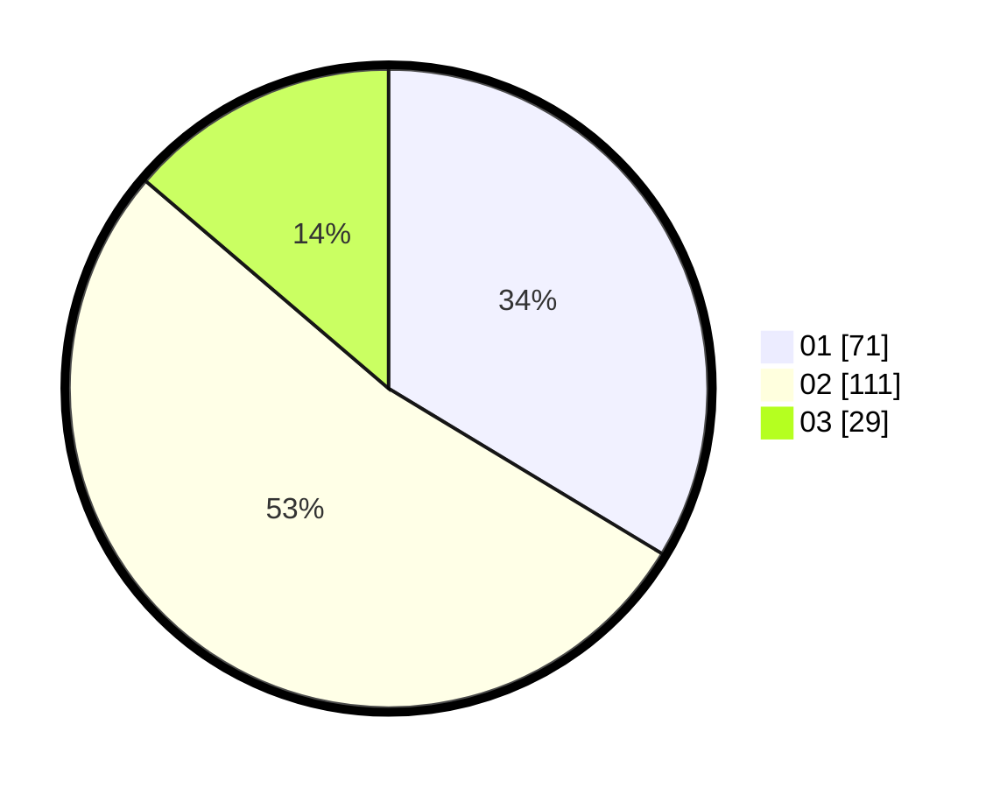

# Hasil

Hasil perolehan suara paslon dapat dilihat pada file paslon-01.txt, paslon-02.txt, dan paslon-03.txt.

Jika tidak ada, artinya data tersebut belum ada pada SIREKAP.

## Perolehan Suara

 * Paslon 01: **71**.
 * Paslon 02: **111**.
 * Paslon 03: **29**.

## Foto C Plano

https://sirekap-obj-formc.kpu.go.id/4a1a/pemilu/ppwp/31/75/05/10/03/3175051003006-20240215-000534--b69557ee-d1ca-417a-9eaa-f77ab5785c91.jpg

https://sirekap-obj-formc.kpu.go.id/4a1a/pemilu/ppwp/31/75/05/10/03/3175051003006-20240215-000718--c9bd5281-8c1e-4707-88d9-46744cf76e54.jpg

https://sirekap-obj-formc.kpu.go.id/4a1a/pemilu/ppwp/31/75/05/10/03/3175051003006-20240215-000844--247adfb7-3ff1-4967-81d9-d108868c7061.jpg
