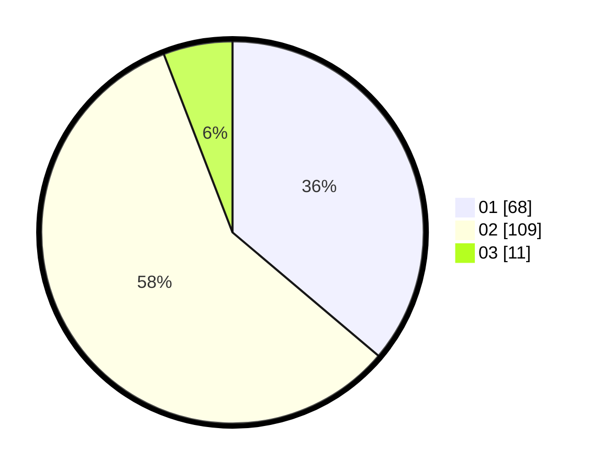

# Hasil

Hasil perolehan suara paslon dapat dilihat pada file paslon-01.txt, paslon-02.txt, dan paslon-03.txt.

Jika tidak ada, artinya data tersebut belum ada pada SIREKAP.

## Perolehan Suara

 * Paslon 01: **68**.
 * Paslon 02: **109**.
 * Paslon 03: **11**.

## Foto C Plano

https://sirekap-obj-formc.kpu.go.id/1a65/pemilu/ppwp/31/75/05/10/03/3175051003013-20240214-210131--91071d36-c748-47f5-ab56-82e590765389.jpg

https://sirekap-obj-formc.kpu.go.id/1a65/pemilu/ppwp/31/75/05/10/03/3175051003013-20240214-210356--1ae2e81c-d778-48be-bb2d-b8f8ac41fbe6.jpg

https://sirekap-obj-formc.kpu.go.id/1a65/pemilu/ppwp/31/75/05/10/03/3175051003013-20240214-210522--92111961-d654-4e29-8bca-8d37a98ca1fe.jpg
