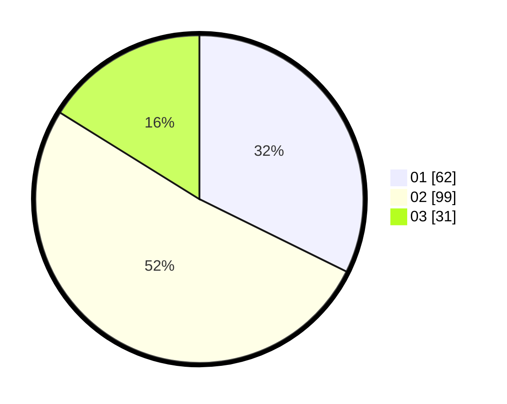

# Hasil

Hasil perolehan suara paslon dapat dilihat pada file paslon-01.txt, paslon-02.txt, dan paslon-03.txt.

Jika tidak ada, artinya data tersebut belum ada pada SIREKAP.

## Perolehan Suara

 * Paslon 01: **62**.
 * Paslon 02: **99**.
 * Paslon 03: **31**.

## Foto C Plano

https://sirekap-obj-formc.kpu.go.id/c1a1/pemilu/ppwp/31/75/05/10/03/3175051003014-20240215-014408--02b89c79-096b-499f-bd9e-f183e85ead01.jpg

https://sirekap-obj-formc.kpu.go.id/c1a1/pemilu/ppwp/31/75/05/10/03/3175051003014-20240215-014515--79a705c8-c9d5-44b4-9df3-cd7f651e93e2.jpg

https://sirekap-obj-formc.kpu.go.id/c1a1/pemilu/ppwp/31/75/05/10/03/3175051003014-20240215-014707--d1dd33b9-c9e9-4458-b072-e7c54adc3c17.jpg
