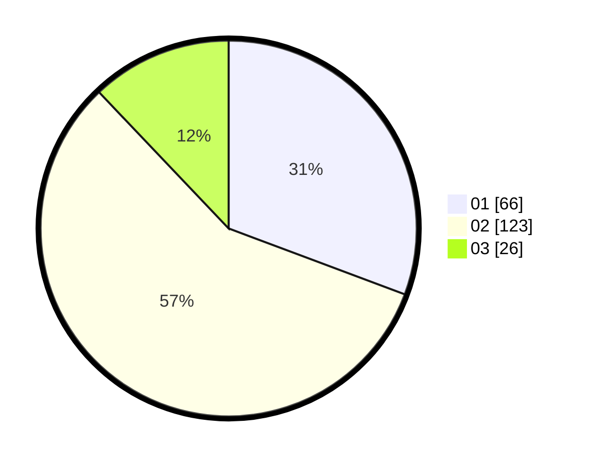

# Hasil

Hasil perolehan suara paslon dapat dilihat pada file paslon-01.txt, paslon-02.txt, dan paslon-03.txt.

Jika tidak ada, artinya data tersebut belum ada pada SIREKAP.

## Perolehan Suara

 * Paslon 01: **66**.
 * Paslon 02: **123**.
 * Paslon 03: **26**.

## Foto C Plano

https://sirekap-obj-formc.kpu.go.id/8d09/pemilu/ppwp/31/75/05/10/03/3175051003019-20240214-230711--fa2e4698-5b32-4859-a4e5-d6d6f9b13507.jpg

https://sirekap-obj-formc.kpu.go.id/8d09/pemilu/ppwp/31/75/05/10/03/3175051003019-20240214-230546--2e26be5c-cc01-4dda-b63e-ce4e8a1f2b05.jpg

https://sirekap-obj-formc.kpu.go.id/8d09/pemilu/ppwp/31/75/05/10/03/3175051003019-20240214-230810--5a9bdb16-7e47-47b5-96b0-f020fc58da80.jpg
