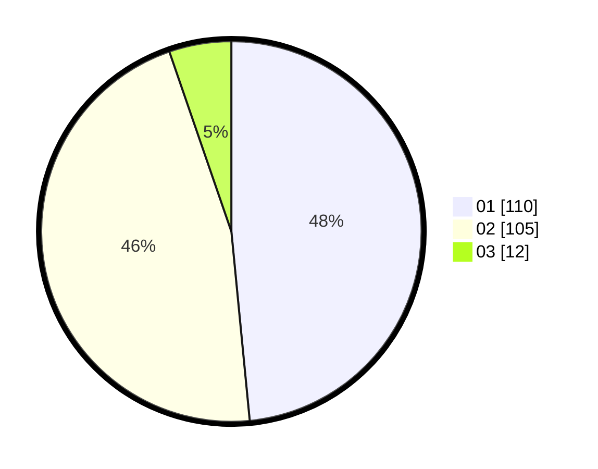

# Hasil

Hasil perolehan suara paslon dapat dilihat pada file paslon-01.txt, paslon-02.txt, dan paslon-03.txt.

Jika tidak ada, artinya data tersebut belum ada pada SIREKAP.

## Perolehan Suara

 * Paslon 01: **110**.
 * Paslon 02: **105**.
 * Paslon 03: **12**.

## Foto C Plano

https://sirekap-obj-formc.kpu.go.id/443f/pemilu/ppwp/31/75/05/10/03/3175051003021-20240214-225503--6815be0c-b838-458d-b376-404df702c95c.jpg

https://sirekap-obj-formc.kpu.go.id/443f/pemilu/ppwp/31/75/05/10/03/3175051003021-20240214-225618--dc53500d-396b-4134-9a92-c108be83ecda.jpg

https://sirekap-obj-formc.kpu.go.id/443f/pemilu/ppwp/31/75/05/10/03/3175051003021-20240214-225654--a94f44f6-ab0e-4b8e-b5c3-9939565b6698.jpg
