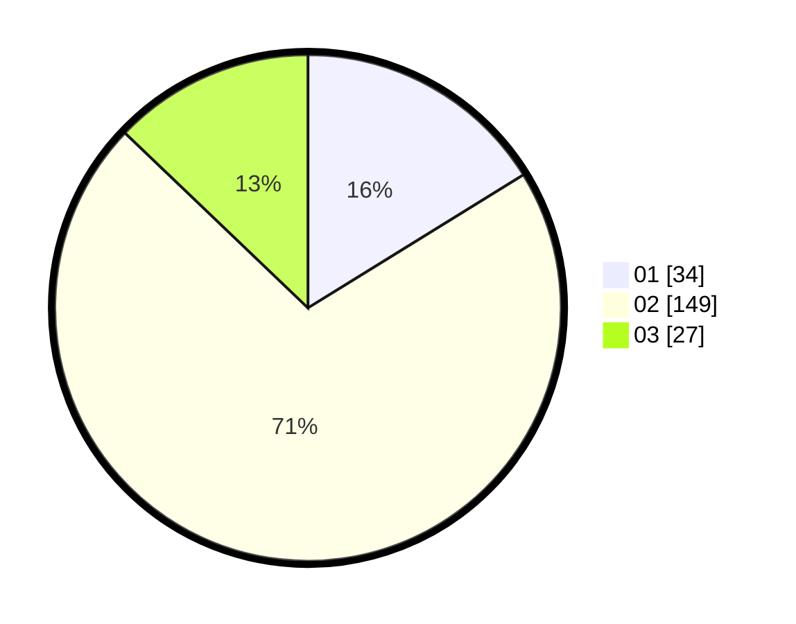

# Hasil

Hasil perolehan suara paslon dapat dilihat pada file paslon-01.txt, paslon-02.txt, dan paslon-03.txt.

Jika tidak ada, artinya data tersebut belum ada pada SIREKAP.

## Perolehan Suara

 * Paslon 01: **34**.
 * Paslon 02: **149**.
 * Paslon 03: **27**.

## Foto C Plano

https://sirekap-obj-formc.kpu.go.id/e301/pemilu/ppwp/31/75/05/10/03/3175051003032-20240214-155755--733c0aff-5088-419d-8bb6-2c278243fa0b.jpg

https://sirekap-obj-formc.kpu.go.id/e301/pemilu/ppwp/31/75/05/10/03/3175051003032-20240214-155622--5d9957f1-48f5-4762-bfaa-cf8b939ad9fe.jpg

https://sirekap-obj-formc.kpu.go.id/e301/pemilu/ppwp/31/75/05/10/03/3175051003032-20240214-155651--ee648ceb-18ad-49a8-b4c0-5e559b234382.jpg

## DATA PEMILIH TETAP

Jumlah pemilih dalam DPT: **267**.
 * L: **121**.
 * P: **146**.

## DATA PENGGUNA HAK PILIH

Jumlah pengguna hak pilih dalam DPT: **214**.
 * L: **92**.
 * P: **122**.

Jumlah pengguna hak pilih dalam DPTb: **0**.
 * L: **0**.
 * P: **0**.

Jumlah pengguna hak pilih dalam DPK: **0**.
 * L: **0**.
 * P: **0**.

Jumlah pengguna hak pilih: **214**.
 * L: **92**.
 * P: **122**.

## JUMLAH SUARA SAH DAN TIDAK SAH

JUMLAH SELURUH SUARA SAH: **210**.

JUMLAH SUARA TIDAK SAH: **4**.

JUMLAH SELURUH SUARA SAH DAN SUARA TIDAK SAH: **214**.
