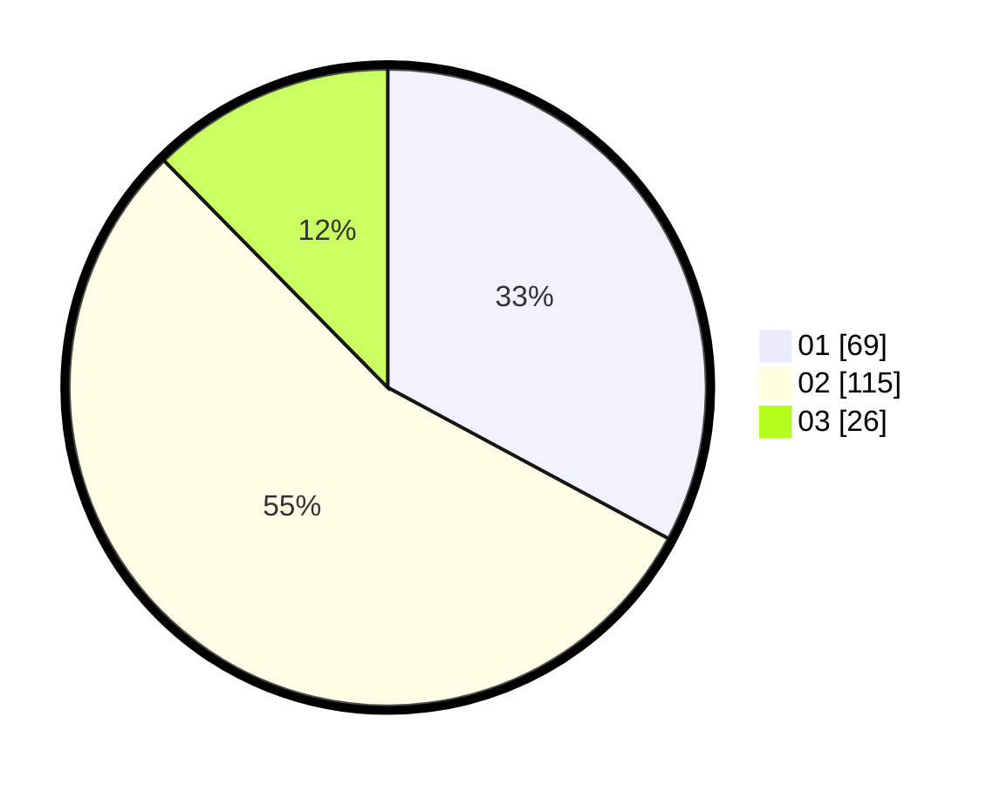

# Hasil

Hasil perolehan suara paslon dapat dilihat pada file paslon-01.txt, paslon-02.txt, dan paslon-03.txt.

Jika tidak ada, artinya data tersebut belum ada pada SIREKAP.

## Perolehan Suara

 * Paslon 01: **69**.
 * Paslon 02: **115**.
 * Paslon 03: **26**.

## Foto C Plano

https://sirekap-obj-formc.kpu.go.id/a5c4/pemilu/ppwp/31/75/05/10/03/3175051003035-20240215-013717--feb7644e-19eb-4f09-b985-ccb1f50e3d3c.jpg

https://sirekap-obj-formc.kpu.go.id/a5c4/pemilu/ppwp/31/75/05/10/03/3175051003035-20240215-013828--ca3edec1-1f97-4b9a-90bf-63ecf5438426.jpg

https://sirekap-obj-formc.kpu.go.id/a5c4/pemilu/ppwp/31/75/05/10/03/3175051003035-20240215-013943--edf51e9a-ea2d-4d86-a75c-08a380257d78.jpg
