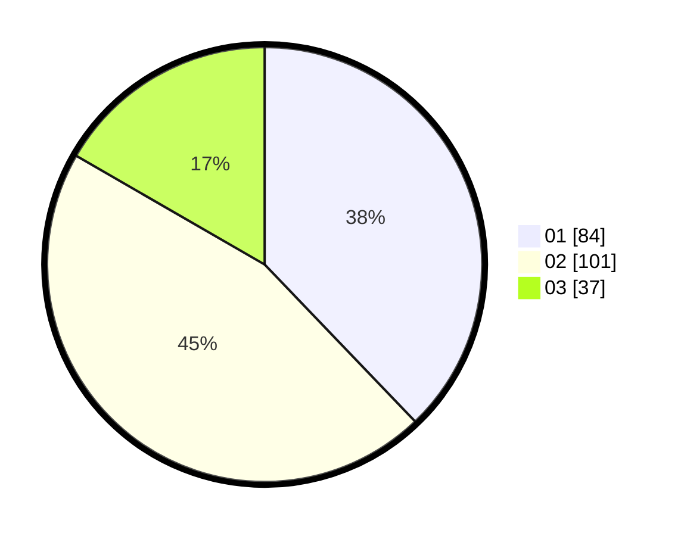

# Hasil

Hasil perolehan suara paslon dapat dilihat pada file paslon-01.txt, paslon-02.txt, dan paslon-03.txt.

Jika tidak ada, artinya data tersebut belum ada pada SIREKAP.

## Perolehan Suara

 * Paslon 01: **84**.
 * Paslon 02: **101**.
 * Paslon 03: **37**.

## Foto C Plano

https://sirekap-obj-formc.kpu.go.id/a184/pemilu/ppwp/31/75/05/10/03/3175051003041-20240214-155545--f48d2fd3-801f-49f6-b800-cf9cebad5e52.jpg

https://sirekap-obj-formc.kpu.go.id/a184/pemilu/ppwp/31/75/05/10/03/3175051003041-20240214-155649--84c33f96-6aae-4459-8e4e-9e58f5806a14.jpg

https://sirekap-obj-formc.kpu.go.id/a184/pemilu/ppwp/31/75/05/10/03/3175051003041-20240214-155748--b1cecfaa-2e83-481b-974f-9a39df5815be.jpg

## DATA PEMILIH TETAP

Jumlah pemilih dalam DPT: **266**.
 * L: **121**.
 * P: **145**.

## DATA PENGGUNA HAK PILIH

Jumlah pengguna hak pilih dalam DPT: **219**.
 * L: **96**.
 * P: **123**.

Jumlah pengguna hak pilih dalam DPTb: **0**.
 * L: **0**.
 * P: **0**.

Jumlah pengguna hak pilih dalam DPK: **5**.
 * L: **2**.
 * P: **3**.

Jumlah pengguna hak pilih: **224**.
 * L: **98**.
 * P: **126**.

## JUMLAH SUARA SAH DAN TIDAK SAH

JUMLAH SELURUH SUARA SAH: **222**.

JUMLAH SUARA TIDAK SAH: **2**.

JUMLAH SELURUH SUARA SAH DAN SUARA TIDAK SAH: **224**.
