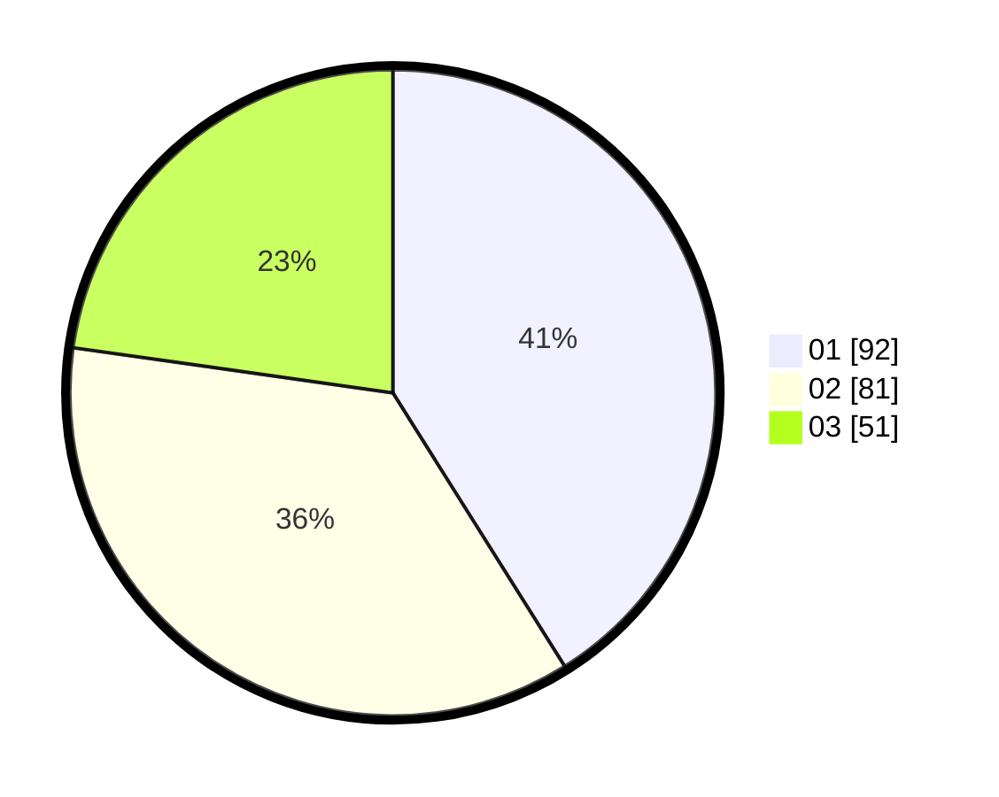

# Hasil

Hasil perolehan suara paslon dapat dilihat pada file paslon-01.txt, paslon-02.txt, dan paslon-03.txt.

Jika tidak ada, artinya data tersebut belum ada pada SIREKAP.

## Perolehan Suara

 * Paslon 01: **92**.
 * Paslon 02: **81**.
 * Paslon 03: **51**.

## Foto C Plano

https://sirekap-obj-formc.kpu.go.id/ff81/pemilu/ppwp/31/75/05/10/03/3175051003043-20240214-190838--05a28803-f943-487a-918f-440bea2cc5b2.jpg

https://sirekap-obj-formc.kpu.go.id/ff81/pemilu/ppwp/31/75/05/10/03/3175051003043-20240214-190844--0142f172-a05d-4b14-99fc-adc684a2cc20.jpg

https://sirekap-obj-formc.kpu.go.id/ff81/pemilu/ppwp/31/75/05/10/03/3175051003043-20240216-022552--015550b6-06de-4b37-9b7b-2d8b7d36f0a7.jpg

## DATA PEMILIH TETAP

Jumlah pemilih dalam DPT: **287**.
 * L: **145**.
 * P: **142**.

## DATA PENGGUNA HAK PILIH

Jumlah pengguna hak pilih dalam DPT: **231**.
 * L: **114**.
 * P: **117**.

Jumlah pengguna hak pilih dalam DPTb: **0**.
 * L: **0**.
 * P: **0**.

Jumlah pengguna hak pilih dalam DPK: **0**.
 * L: **0**.
 * P: **0**.

Jumlah pengguna hak pilih: **231**.
 * L: **114**.
 * P: **117**.

## JUMLAH SUARA SAH DAN TIDAK SAH

JUMLAH SELURUH SUARA SAH: **224**.

JUMLAH SUARA TIDAK SAH: **7**.

JUMLAH SELURUH SUARA SAH DAN SUARA TIDAK SAH: **231**.
