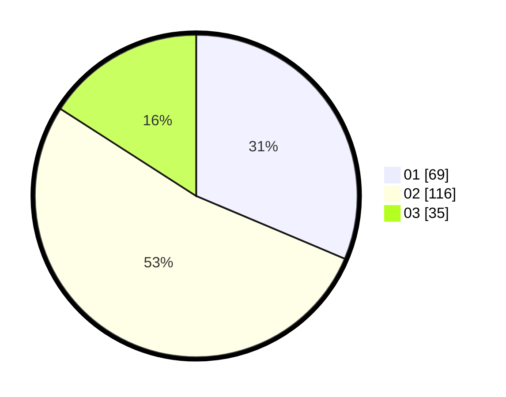

# Hasil

Hasil perolehan suara paslon dapat dilihat pada file paslon-01.txt, paslon-02.txt, dan paslon-03.txt.

Jika tidak ada, artinya data tersebut belum ada pada SIREKAP.

## Perolehan Suara

 * Paslon 01: **69**.
 * Paslon 02: **116**.
 * Paslon 03: **35**.

## Foto C Plano

https://sirekap-obj-formc.kpu.go.id/4c3f/pemilu/ppwp/31/75/05/10/03/3175051003047-20240214-201202--b569871d-7d01-4f49-b7cf-aea915ed1b3a.jpg

https://sirekap-obj-formc.kpu.go.id/4c3f/pemilu/ppwp/31/75/05/10/03/3175051003047-20240214-201301--434336ba-3467-4039-a03e-9272109e4ce9.jpg

https://sirekap-obj-formc.kpu.go.id/4c3f/pemilu/ppwp/31/75/05/10/03/3175051003047-20240214-201346--dcfabfd5-150f-47b0-962e-3de7bad69c40.jpg

## DATA PEMILIH TETAP

Jumlah pemilih dalam DPT: **276**.
 * L: **133**.
 * P: **143**.

## DATA PENGGUNA HAK PILIH

Jumlah pengguna hak pilih dalam DPT: **222**.
 * L: **102**.
 * P: **120**.

Jumlah pengguna hak pilih dalam DPTb: **0**.
 * L: **0**.
 * P: **0**.

Jumlah pengguna hak pilih dalam DPK: **2**.
 * L: **2**.
 * P: **0**.

Jumlah pengguna hak pilih: **224**.
 * L: **104**.
 * P: **120**.

## JUMLAH SUARA SAH DAN TIDAK SAH

JUMLAH SELURUH SUARA SAH: **220**.

JUMLAH SUARA TIDAK SAH: **4**.

JUMLAH SELURUH SUARA SAH DAN SUARA TIDAK SAH: **224**.
