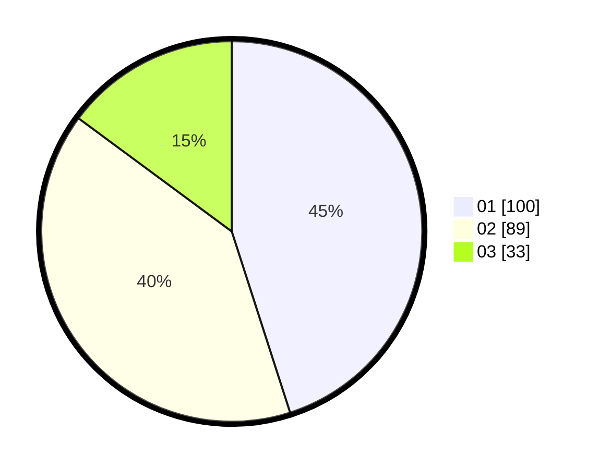

# Hasil

Hasil perolehan suara paslon dapat dilihat pada file paslon-01.txt, paslon-02.txt, dan paslon-03.txt.

Jika tidak ada, artinya data tersebut belum ada pada SIREKAP.

## Perolehan Suara

 * Paslon 01: **100**.
 * Paslon 02: **89**.
 * Paslon 03: **33**.

## Foto C Plano

https://sirekap-obj-formc.kpu.go.id/00c2/pemilu/ppwp/31/75/05/10/03/3175051003050-20240215-030723--a0b84bb8-7931-46f5-9163-fd5d0c74fb9b.jpg

https://sirekap-obj-formc.kpu.go.id/00c2/pemilu/ppwp/31/75/05/10/03/3175051003050-20240215-030728--add7b50f-a04c-4c36-854f-2deb753d7a7d.jpg

https://sirekap-obj-formc.kpu.go.id/00c2/pemilu/ppwp/31/75/05/10/03/3175051003050-20240215-030732--c83e5423-844f-49ef-a253-238a36545be6.jpg
