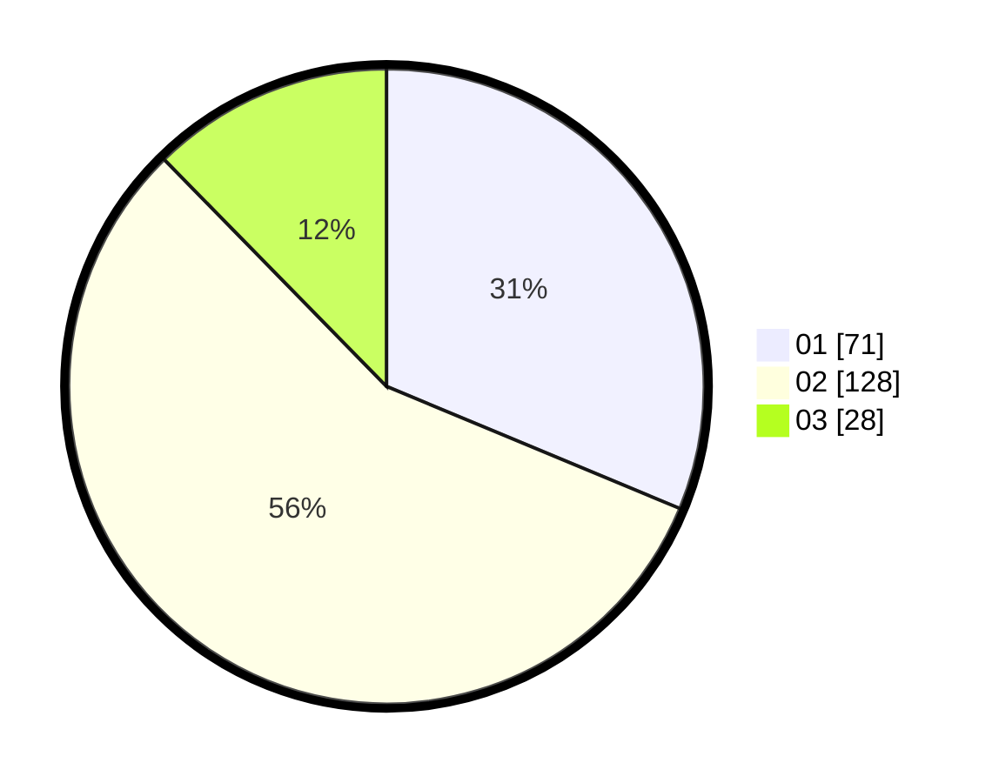

# Hasil

Hasil perolehan suara paslon dapat dilihat pada file paslon-01.txt, paslon-02.txt, dan paslon-03.txt.

Jika tidak ada, artinya data tersebut belum ada pada SIREKAP.

## Perolehan Suara

 * Paslon 01: **71**.
 * Paslon 02: **128**.
 * Paslon 03: **28**.

## Foto C Plano

https://sirekap-obj-formc.kpu.go.id/4ac2/pemilu/ppwp/31/75/05/10/03/3175051003056-20240215-151415--d41112ca-40ab-449a-a74d-0be4cc992874.jpg

https://sirekap-obj-formc.kpu.go.id/4ac2/pemilu/ppwp/31/75/05/10/03/3175051003056-20240214-232719--e08afa22-ebfb-46bd-950d-987e349578f2.jpg

https://sirekap-obj-formc.kpu.go.id/4ac2/pemilu/ppwp/31/75/05/10/03/3175051003056-20240215-084547--d142f931-9acc-4f40-a008-20ac64f4f7e0.jpg
