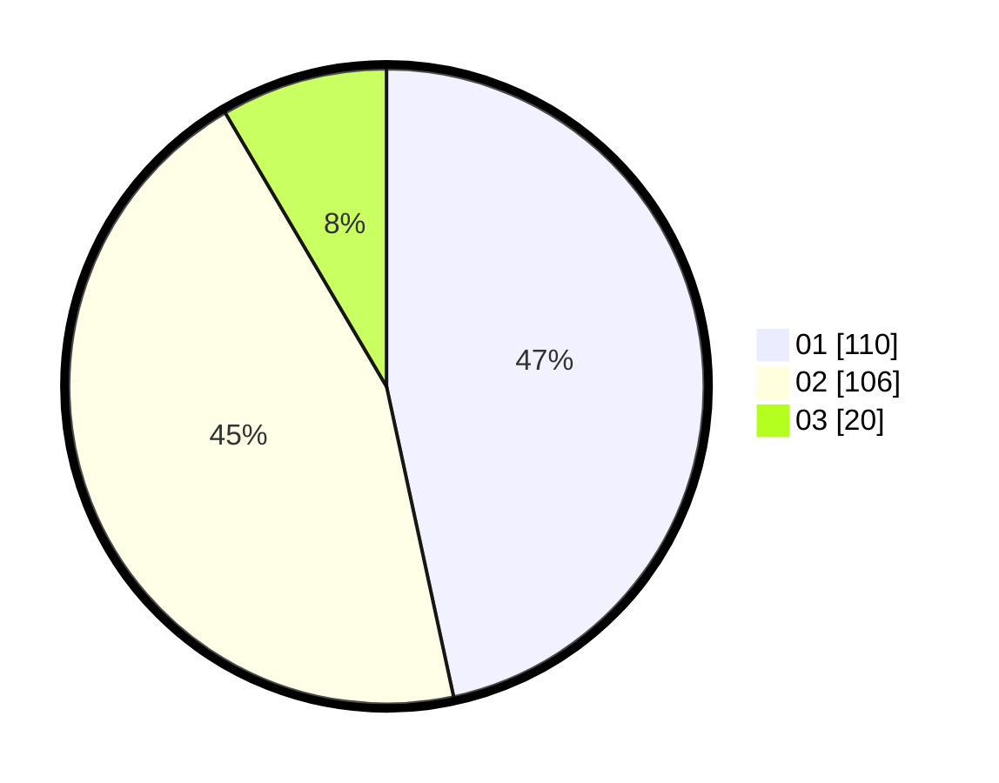

# Hasil

Hasil perolehan suara paslon dapat dilihat pada file paslon-01.txt, paslon-02.txt, dan paslon-03.txt.

Jika tidak ada, artinya data tersebut belum ada pada SIREKAP.

## Perolehan Suara

 * Paslon 01: **110**.
 * Paslon 02: **106**.
 * Paslon 03: **20**.

## Foto C Plano

https://sirekap-obj-formc.kpu.go.id/2e49/pemilu/ppwp/31/75/05/10/03/3175051003058-20240214-210208--682ccf7b-cfdd-43e5-8b19-06d75e196968.jpg

https://sirekap-obj-formc.kpu.go.id/2e49/pemilu/ppwp/31/75/05/10/03/3175051003058-20240214-210302--0870a950-ea58-4993-9d29-40ca4f5e9364.jpg

https://sirekap-obj-formc.kpu.go.id/2e49/pemilu/ppwp/31/75/05/10/03/3175051003058-20240214-210404--90505647-f6ee-4b0e-b032-aa60d541c303.jpg
