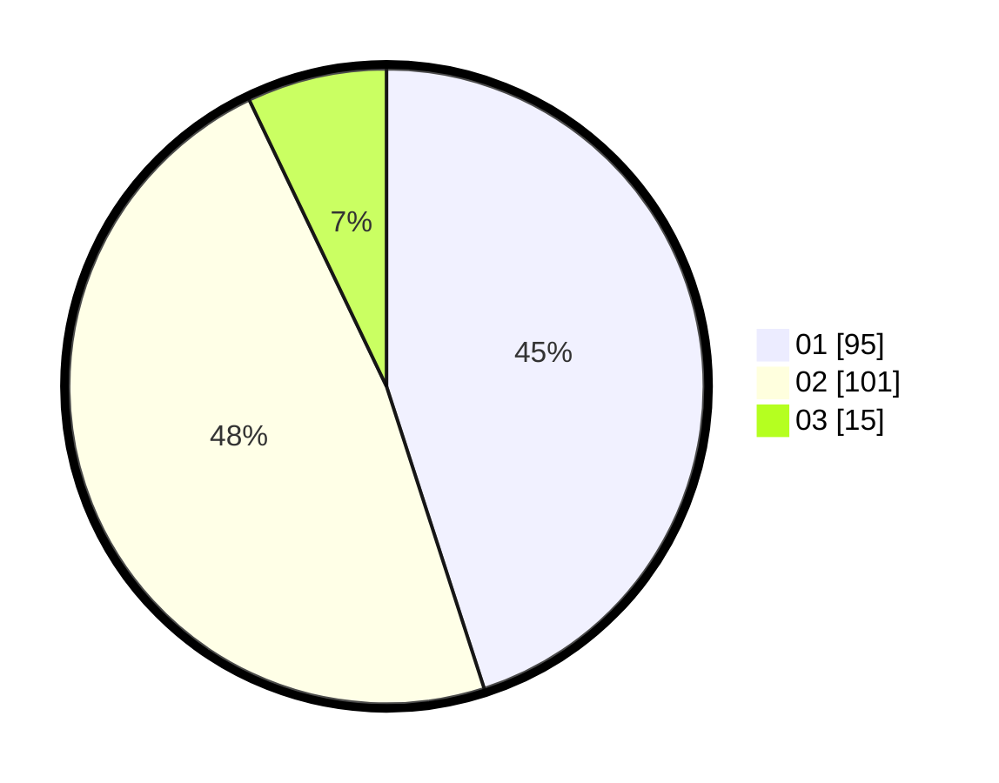

# Hasil

Hasil perolehan suara paslon dapat dilihat pada file paslon-01.txt, paslon-02.txt, dan paslon-03.txt.

Jika tidak ada, artinya data tersebut belum ada pada SIREKAP.

## Perolehan Suara

 * Paslon 01: **95**.
 * Paslon 02: **101**.
 * Paslon 03: **15**.

## Foto C Plano

https://sirekap-obj-formc.kpu.go.id/a888/pemilu/ppwp/31/75/05/10/03/3175051003059-20240215-021011--b90af602-fbb0-4c9a-b06d-5c883d43611c.jpg

https://sirekap-obj-formc.kpu.go.id/a888/pemilu/ppwp/31/75/05/10/03/3175051003059-20240215-004030--50b5c3c4-4b00-4556-9cc6-79f0622faeed.jpg

https://sirekap-obj-formc.kpu.go.id/a888/pemilu/ppwp/31/75/05/10/03/3175051003059-20240215-021210--84427610-94bc-465f-9b4b-d2996b47d172.jpg
