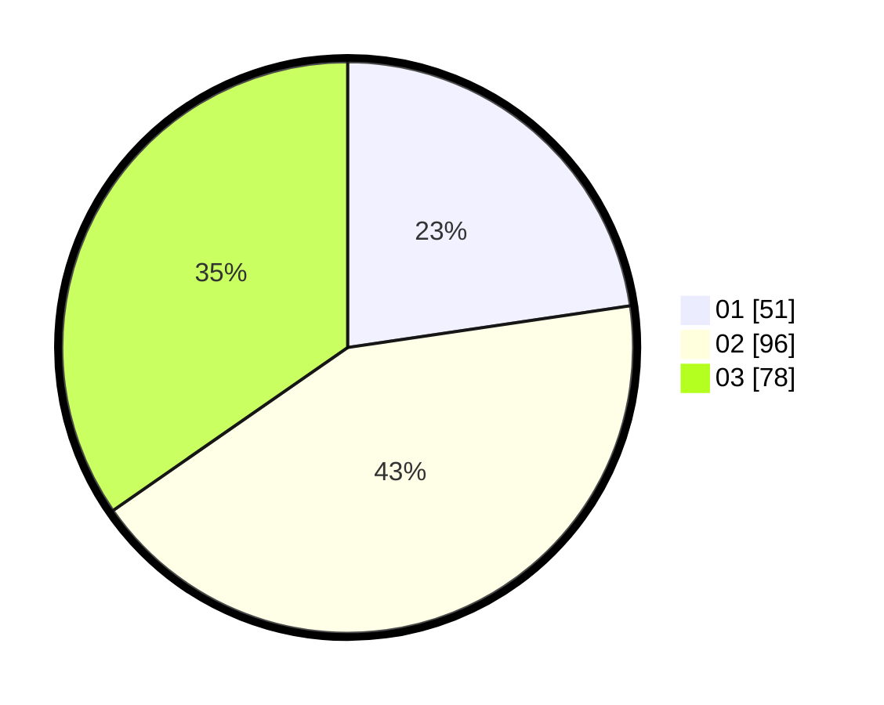

# Hasil

Hasil perolehan suara paslon dapat dilihat pada file paslon-01.txt, paslon-02.txt, dan paslon-03.txt.

Jika tidak ada, artinya data tersebut belum ada pada SIREKAP.

## Perolehan Suara

 * Paslon 01: **51**.
 * Paslon 02: **96**.
 * Paslon 03: **78**.

## Foto C Plano

https://sirekap-obj-formc.kpu.go.id/915e/pemilu/ppwp/31/75/05/10/03/3175051003061-20240215-021656--f3e6f40c-eeab-4598-94ee-0f8d4ae0e60e.jpg

https://sirekap-obj-formc.kpu.go.id/915e/pemilu/ppwp/31/75/05/10/03/3175051003061-20240215-021834--0077bb04-4108-4d83-8a3f-131e328bf24b.jpg

https://sirekap-obj-formc.kpu.go.id/915e/pemilu/ppwp/31/75/05/10/03/3175051003061-20240215-021937--ad9906d5-ebce-454a-8866-ff1645a82549.jpg
