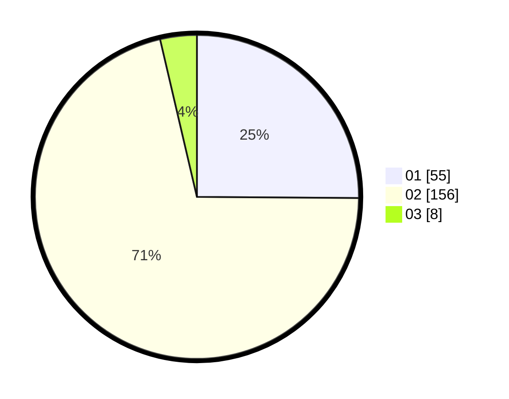

# Hasil

Hasil perolehan suara paslon dapat dilihat pada file paslon-01.txt, paslon-02.txt, dan paslon-03.txt.

Jika tidak ada, artinya data tersebut belum ada pada SIREKAP.

## Perolehan Suara

 * Paslon 01: **55**.
 * Paslon 02: **156**.
 * Paslon 03: **8**.

## Foto C Plano

https://sirekap-obj-formc.kpu.go.id/d488/pemilu/ppwp/31/75/05/10/03/3175051003064-20240214-195120--f87a66fd-bd5f-422b-a7d6-84d54eb604ab.jpg

https://sirekap-obj-formc.kpu.go.id/d488/pemilu/ppwp/31/75/05/10/03/3175051003064-20240214-200151--c7877814-fb00-44f0-bfd4-f31dec27bb32.jpg

https://sirekap-obj-formc.kpu.go.id/d488/pemilu/ppwp/31/75/05/10/03/3175051003064-20240214-200405--a620c298-b65d-4bfe-a0c4-75bbe31c421b.jpg

## DATA PEMILIH TETAP

Jumlah pemilih dalam DPT: **251**.
 * L: **116**.
 * P: **135**.

## DATA PENGGUNA HAK PILIH

Jumlah pengguna hak pilih dalam DPT: **218**.
 * L: **96**.
 * P: **122**.

Jumlah pengguna hak pilih dalam DPTb: **1**.
 * L: **0**.
 * P: **1**.

Jumlah pengguna hak pilih dalam DPK: **0**.
 * L: **0**.
 * P: **0**.

Jumlah pengguna hak pilih: **219**.
 * L: **96**.
 * P: **123**.

## JUMLAH SUARA SAH DAN TIDAK SAH

JUMLAH SELURUH SUARA SAH: **219**.

JUMLAH SUARA TIDAK SAH: **0**.

JUMLAH SELURUH SUARA SAH DAN SUARA TIDAK SAH: **219**.
