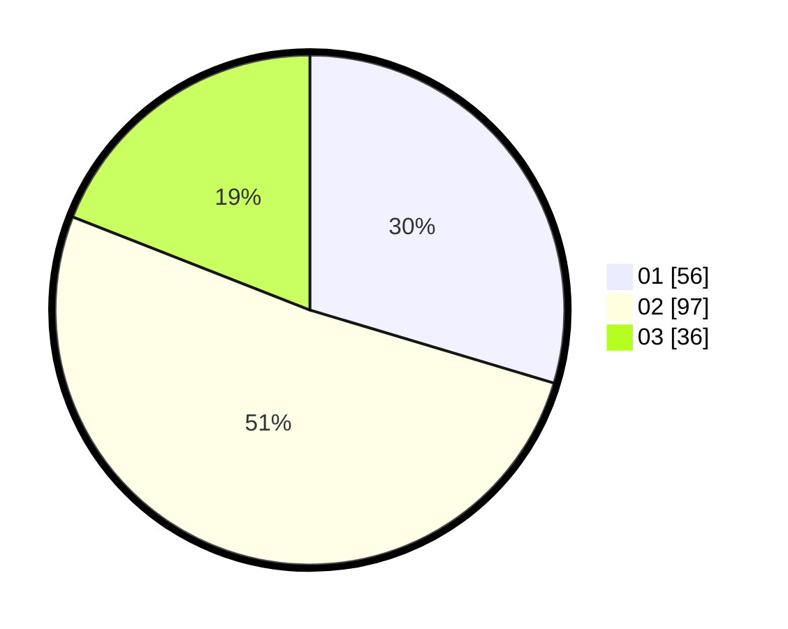

# Hasil

Hasil perolehan suara paslon dapat dilihat pada file paslon-01.txt, paslon-02.txt, dan paslon-03.txt.

Jika tidak ada, artinya data tersebut belum ada pada SIREKAP.

## Perolehan Suara

 * Paslon 01: **56**.
 * Paslon 02: **97**.
 * Paslon 03: **36**.

## Foto C Plano

https://sirekap-obj-formc.kpu.go.id/8250/pemilu/ppwp/31/75/05/10/03/3175051003074-20240214-234902--6249f07b-7257-4449-874a-4e85e8617191.jpg

https://sirekap-obj-formc.kpu.go.id/8250/pemilu/ppwp/31/75/05/10/03/3175051003074-20240214-235107--cd3fbe41-2fe7-459f-ae6e-54e4da930470.jpg

https://sirekap-obj-formc.kpu.go.id/8250/pemilu/ppwp/31/75/05/10/03/3175051003074-20240214-235229--52686ad8-b9a4-4767-a17e-eff6e7a974e3.jpg
