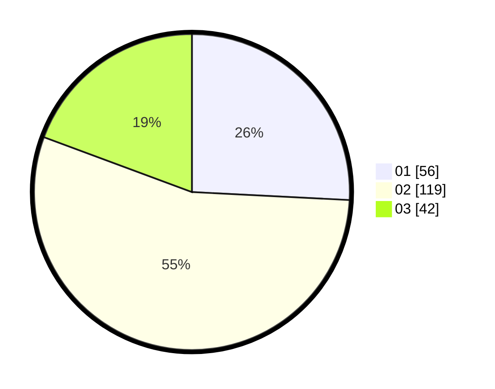

# Hasil

Hasil perolehan suara paslon dapat dilihat pada file paslon-01.txt, paslon-02.txt, dan paslon-03.txt.

Jika tidak ada, artinya data tersebut belum ada pada SIREKAP.

## Perolehan Suara

 * Paslon 01: **56**.
 * Paslon 02: **119**.
 * Paslon 03: **42**.

## Foto C Plano

https://sirekap-obj-formc.kpu.go.id/091a/pemilu/ppwp/31/75/05/10/03/3175051003077-20240214-224251--e4ed3ec7-8cb7-4052-bad4-e7694001f205.jpg

https://sirekap-obj-formc.kpu.go.id/091a/pemilu/ppwp/31/75/05/10/03/3175051003077-20240214-224604--0e36f0c1-dd31-47f7-8ee5-3008ead92f09.jpg

https://sirekap-obj-formc.kpu.go.id/091a/pemilu/ppwp/31/75/05/10/03/3175051003077-20240214-224741--a4b0c9f6-89a5-48b7-b34f-8ba4cff48fcc.jpg

## DATA PEMILIH TETAP

Jumlah pemilih dalam DPT: **263**.
 * L: **124**.
 * P: **139**.

## DATA PENGGUNA HAK PILIH

Jumlah pengguna hak pilih dalam DPT: **217**.
 * L: **94**.
 * P: **123**.

Jumlah pengguna hak pilih dalam DPTb: **2**.
 * L: **0**.
 * P: **2**.

Jumlah pengguna hak pilih dalam DPK: **3**.
 * L: **2**.
 * P: **1**.

Jumlah pengguna hak pilih: **222**.
 * L: **96**.
 * P: **126**.

## JUMLAH SUARA SAH DAN TIDAK SAH

JUMLAH SELURUH SUARA SAH: **217**.

JUMLAH SUARA TIDAK SAH: **5**.

JUMLAH SELURUH SUARA SAH DAN SUARA TIDAK SAH: **222**.
