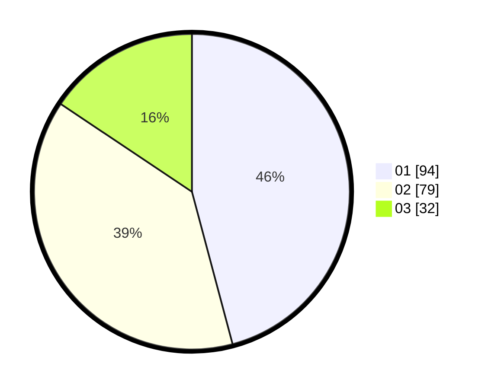

# Hasil

Hasil perolehan suara paslon dapat dilihat pada file paslon-01.txt, paslon-02.txt, dan paslon-03.txt.

Jika tidak ada, artinya data tersebut belum ada pada SIREKAP.

## Perolehan Suara

 * Paslon 01: **94**.
 * Paslon 02: **79**.
 * Paslon 03: **32**.

## Foto C Plano

https://sirekap-obj-formc.kpu.go.id/eac6/pemilu/ppwp/31/75/05/10/03/3175051003087-20240214-233010--33114a78-fafb-496f-aef1-945f91a51fbf.jpg

https://sirekap-obj-formc.kpu.go.id/eac6/pemilu/ppwp/31/75/05/10/03/3175051003087-20240214-195403--e1b3dcdc-d9df-485a-9658-762b345231a1.jpg

https://sirekap-obj-formc.kpu.go.id/eac6/pemilu/ppwp/31/75/05/10/03/3175051003087-20240215-015252--2d664f06-2462-48d4-837c-cf431b509daa.jpg
