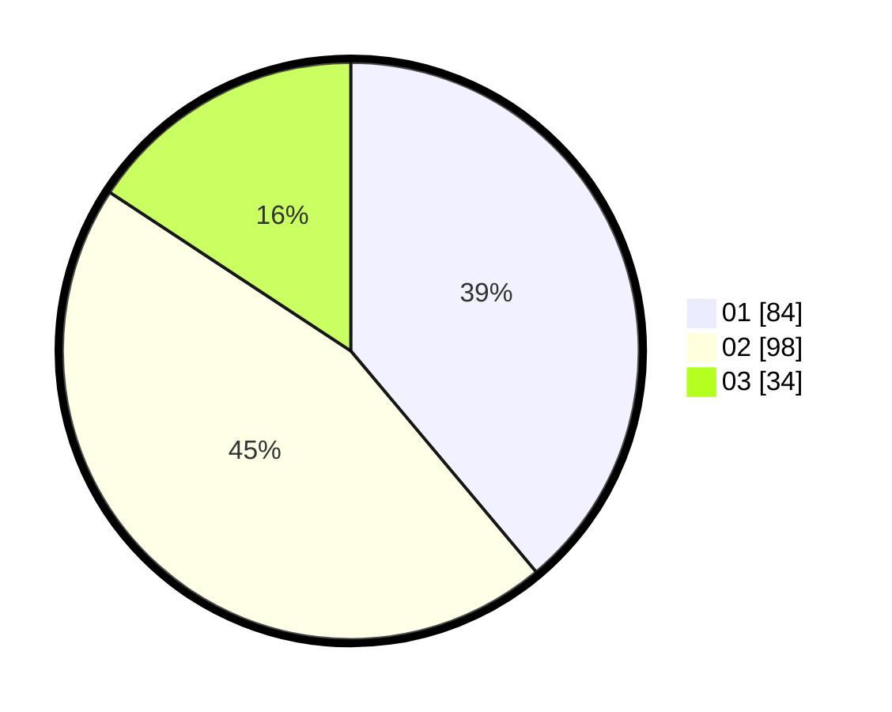

# Hasil

Hasil perolehan suara paslon dapat dilihat pada file paslon-01.txt, paslon-02.txt, dan paslon-03.txt.

Jika tidak ada, artinya data tersebut belum ada pada SIREKAP.

## Perolehan Suara

 * Paslon 01: **84**.
 * Paslon 02: **98**.
 * Paslon 03: **34**.

## Foto C Plano

https://sirekap-obj-formc.kpu.go.id/b877/pemilu/ppwp/31/75/05/10/03/3175051003091-20240214-141809--c90ae87c-3eb3-41a8-9db8-003bfd1f8a96.jpg

https://sirekap-obj-formc.kpu.go.id/b877/pemilu/ppwp/31/75/05/10/03/3175051003091-20240214-141555--15d29474-ec38-467a-9b79-221f9cb8cd07.jpg

https://sirekap-obj-formc.kpu.go.id/b877/pemilu/ppwp/31/75/05/10/03/3175051003091-20240214-203056--e584bbe5-3e76-45ed-b76e-36e6e7d86cc9.jpg

## DATA PEMILIH TETAP

Jumlah pemilih dalam DPT: **261**.
 * L: **126**.
 * P: **135**.

## DATA PENGGUNA HAK PILIH

Jumlah pengguna hak pilih dalam DPT: **218**.
 * L: **102**.
 * P: **116**.

Jumlah pengguna hak pilih dalam DPTb: **0**.
 * L: **0**.
 * P: **0**.

Jumlah pengguna hak pilih dalam DPK: **5**.
 * L: **1**.
 * P: **4**.

Jumlah pengguna hak pilih: **223**.
 * L: **103**.
 * P: **120**.

## JUMLAH SUARA SAH DAN TIDAK SAH

JUMLAH SELURUH SUARA SAH: **216**.

JUMLAH SUARA TIDAK SAH: **7**.

JUMLAH SELURUH SUARA SAH DAN SUARA TIDAK SAH: **223**.
