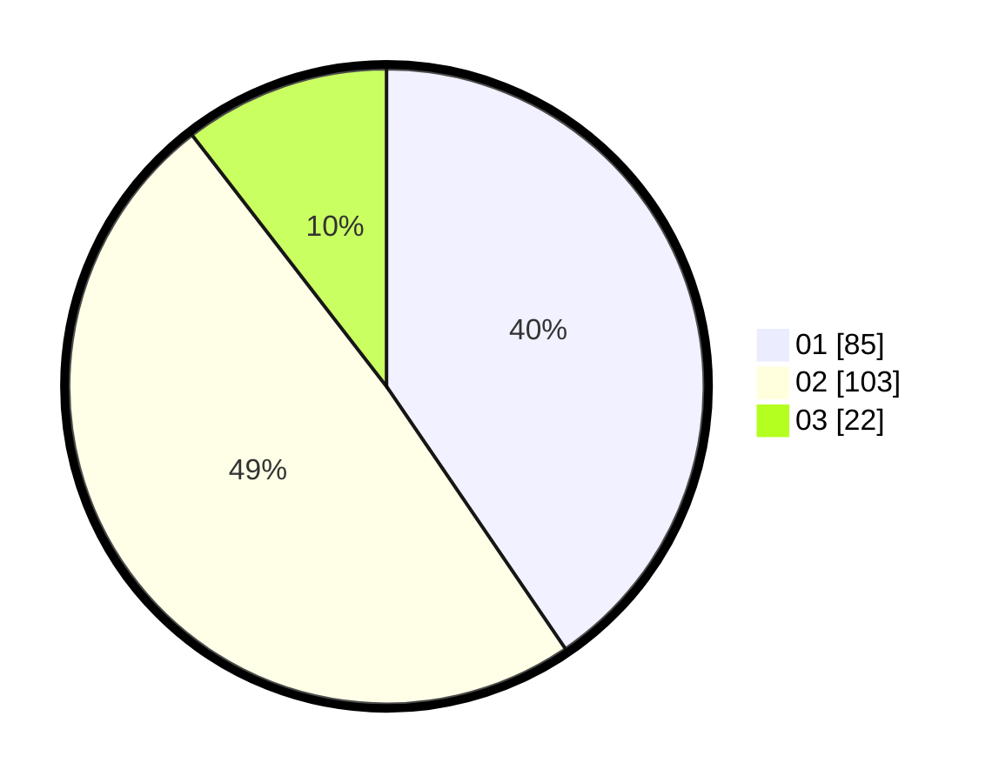

# Hasil

Hasil perolehan suara paslon dapat dilihat pada file paslon-01.txt, paslon-02.txt, dan paslon-03.txt.

Jika tidak ada, artinya data tersebut belum ada pada SIREKAP.

## Perolehan Suara

 * Paslon 01: **85**.
 * Paslon 02: **103**.
 * Paslon 03: **22**.

## Foto C Plano

https://sirekap-obj-formc.kpu.go.id/31df/pemilu/ppwp/31/75/05/10/03/3175051003100-20240215-000204--211d3050-335a-4a19-a2a7-afdf5147ac13.jpg

https://sirekap-obj-formc.kpu.go.id/31df/pemilu/ppwp/31/75/05/10/03/3175051003100-20240215-000537--e92d3d68-2de3-4d71-911c-1a85729b0fcc.jpg

https://sirekap-obj-formc.kpu.go.id/31df/pemilu/ppwp/31/75/05/10/03/3175051003100-20240215-000702--08b08dc3-6ec2-4064-9619-4b7778865edd.jpg
