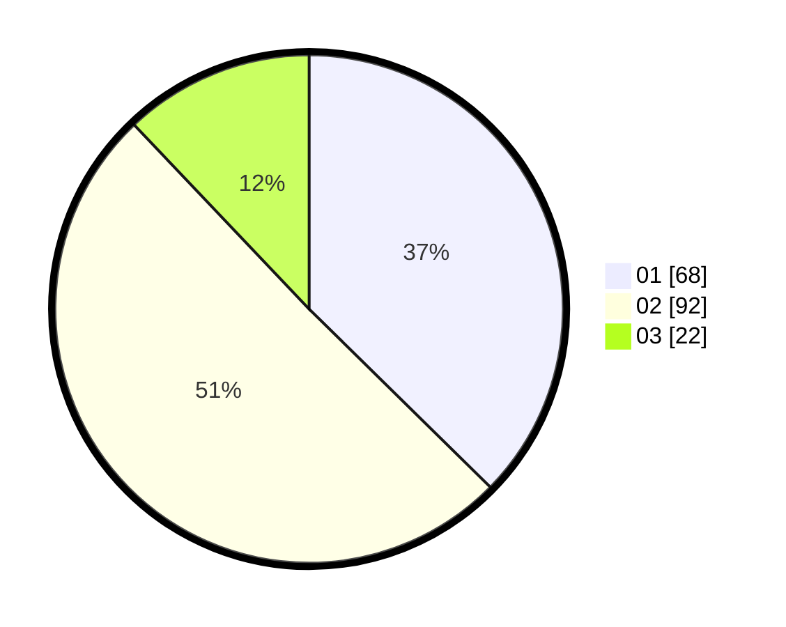

# Hasil

Hasil perolehan suara paslon dapat dilihat pada file paslon-01.txt, paslon-02.txt, dan paslon-03.txt.

Jika tidak ada, artinya data tersebut belum ada pada SIREKAP.

## Perolehan Suara

 * Paslon 01: **68**.
 * Paslon 02: **92**.
 * Paslon 03: **22**.

## Foto C Plano

https://sirekap-obj-formc.kpu.go.id/bb42/pemilu/ppwp/31/75/05/10/03/3175051003102-20240214-231105--1a0d9545-9eca-42a3-908d-864b894ab334.jpg

https://sirekap-obj-formc.kpu.go.id/bb42/pemilu/ppwp/31/75/05/10/03/3175051003102-20240214-231215--3c36e134-cff2-4fe4-af81-4af335bfec0d.jpg

https://sirekap-obj-formc.kpu.go.id/bb42/pemilu/ppwp/31/75/05/10/03/3175051003102-20240214-231533--254f485b-58b9-4512-96c7-4c4584538f58.jpg
