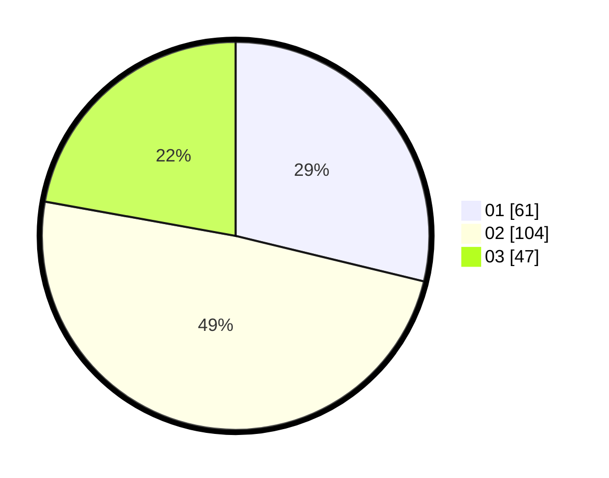

# Hasil

Hasil perolehan suara paslon dapat dilihat pada file paslon-01.txt, paslon-02.txt, dan paslon-03.txt.

Jika tidak ada, artinya data tersebut belum ada pada SIREKAP.

## Perolehan Suara

 * Paslon 01: **61**.
 * Paslon 02: **104**.
 * Paslon 03: **47**.

## Foto C Plano

https://sirekap-obj-formc.kpu.go.id/a565/pemilu/ppwp/31/75/05/10/03/3175051003109-20240214-214847--0704b78f-2239-44fb-b547-a0f947354426.jpg

https://sirekap-obj-formc.kpu.go.id/a565/pemilu/ppwp/31/75/05/10/03/3175051003109-20240214-214905--4c4bfd30-64bb-4e97-9b04-220be19dd13c.jpg

https://sirekap-obj-formc.kpu.go.id/a565/pemilu/ppwp/31/75/05/10/03/3175051003109-20240214-214934--181208c9-ab13-4127-821c-9b3e5118ccea.jpg

## DATA PEMILIH TETAP

Jumlah pemilih dalam DPT: **267**.
 * L: **123**.
 * P: **144**.

## DATA PENGGUNA HAK PILIH

Jumlah pengguna hak pilih dalam DPT: **211**.
 * L: **93**.
 * P: **118**.

Jumlah pengguna hak pilih dalam DPTb: **2**.
 * L: **1**.
 * P: **1**.

Jumlah pengguna hak pilih dalam DPK: **3**.
 * L: **2**.
 * P: **1**.

Jumlah pengguna hak pilih: **216**.
 * L: **96**.
 * P: **120**.

## JUMLAH SUARA SAH DAN TIDAK SAH

JUMLAH SELURUH SUARA SAH: **212**.

JUMLAH SUARA TIDAK SAH: **4**.

JUMLAH SELURUH SUARA SAH DAN SUARA TIDAK SAH: **216**.
