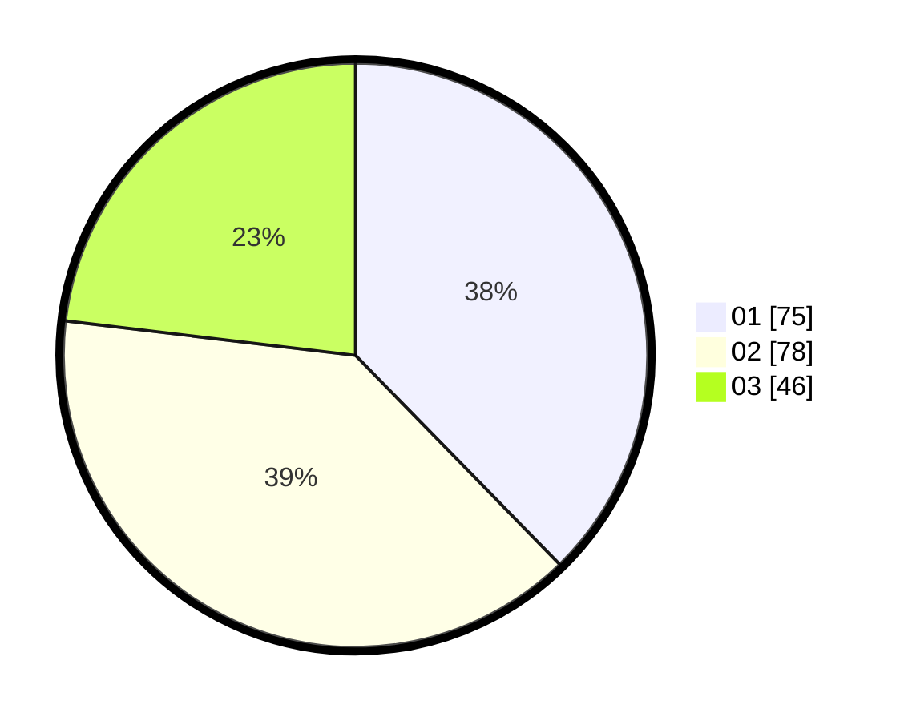

# Hasil

Hasil perolehan suara paslon dapat dilihat pada file paslon-01.txt, paslon-02.txt, dan paslon-03.txt.

Jika tidak ada, artinya data tersebut belum ada pada SIREKAP.

## Perolehan Suara

 * Paslon 01: **75**.
 * Paslon 02: **78**.
 * Paslon 03: **46**.

## Foto C Plano

https://sirekap-obj-formc.kpu.go.id/ece4/pemilu/ppwp/31/75/05/10/03/3175051003110-20240214-220130--aec2e48f-a14d-446e-b903-c5469bd8e9ce.jpg

https://sirekap-obj-formc.kpu.go.id/ece4/pemilu/ppwp/31/75/05/10/03/3175051003110-20240218-104232--e211af4b-db7f-425b-8165-e45601b246f2.jpg

https://sirekap-obj-formc.kpu.go.id/ece4/pemilu/ppwp/31/75/05/10/03/3175051003110-20240214-220204--5a6e099f-aaad-4803-b33d-ff790868918a.jpg

## DATA PEMILIH TETAP

Jumlah pemilih dalam DPT: **256**.
 * L: **125**.
 * P: **131**.

## DATA PENGGUNA HAK PILIH

Jumlah pengguna hak pilih dalam DPT: **203**.
 * L: **96**.
 * P: **107**.

Jumlah pengguna hak pilih dalam DPTb: **0**.
 * L: **0**.
 * P: **0**.

Jumlah pengguna hak pilih dalam DPK: **0**.
 * L: **0**.
 * P: **0**.

Jumlah pengguna hak pilih: **203**.
 * L: **96**.
 * P: **107**.

## JUMLAH SUARA SAH DAN TIDAK SAH

JUMLAH SELURUH SUARA SAH: **199**.

JUMLAH SUARA TIDAK SAH: **4**.

JUMLAH SELURUH SUARA SAH DAN SUARA TIDAK SAH: **203**.
