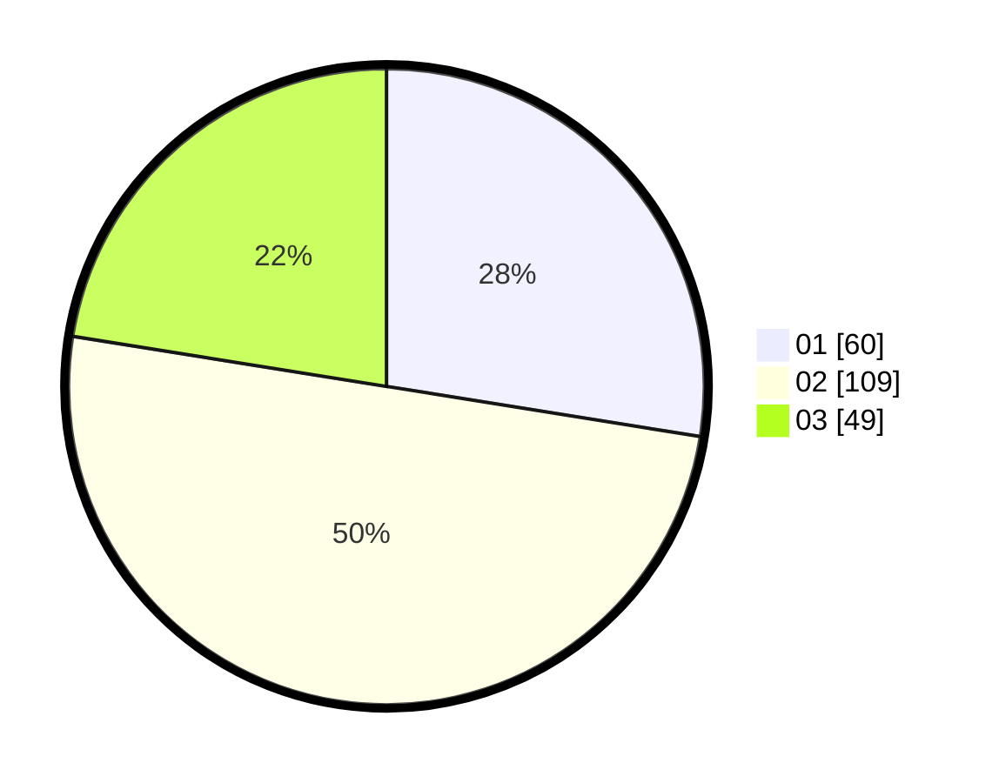

# Hasil

Hasil perolehan suara paslon dapat dilihat pada file paslon-01.txt, paslon-02.txt, dan paslon-03.txt.

Jika tidak ada, artinya data tersebut belum ada pada SIREKAP.

## Perolehan Suara

 * Paslon 01: **60**.
 * Paslon 02: **109**.
 * Paslon 03: **49**.

## Foto C Plano

https://sirekap-obj-formc.kpu.go.id/a21b/pemilu/ppwp/31/75/05/10/03/3175051003111-20240215-012314--56648dff-bbfc-4114-a522-a7ebd2e2ac93.jpg

https://sirekap-obj-formc.kpu.go.id/a21b/pemilu/ppwp/31/75/05/10/03/3175051003111-20240215-012233--4c93e207-664a-4d56-a9e9-959f3b4e846f.jpg

https://sirekap-obj-formc.kpu.go.id/a21b/pemilu/ppwp/31/75/05/10/03/3175051003111-20240215-012141--29259d44-21f3-425d-93ba-d17d821c6e5e.jpg
