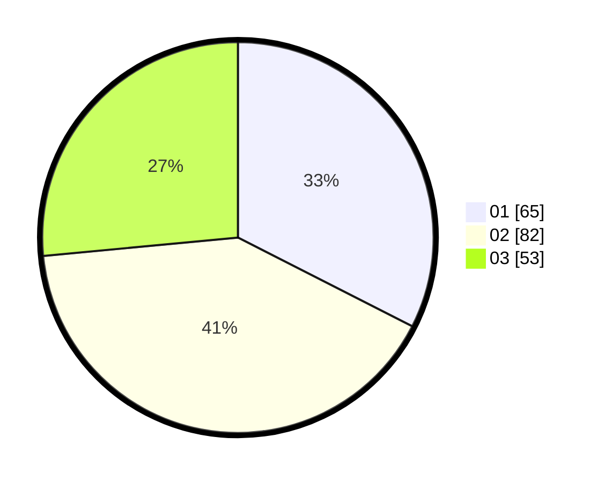

# Hasil

Hasil perolehan suara paslon dapat dilihat pada file paslon-01.txt, paslon-02.txt, dan paslon-03.txt.

Jika tidak ada, artinya data tersebut belum ada pada SIREKAP.

## Perolehan Suara

 * Paslon 01: **65**.
 * Paslon 02: **82**.
 * Paslon 03: **53**.

## Foto C Plano

https://sirekap-obj-formc.kpu.go.id/cc71/pemilu/ppwp/31/75/05/10/03/3175051003112-20240215-031302--58b855e0-94b1-49a7-98df-f188c6e0de28.jpg

https://sirekap-obj-formc.kpu.go.id/cc71/pemilu/ppwp/31/75/05/10/03/3175051003112-20240215-031106--c064c425-0f9a-4eca-9bcb-20ed6ed121ff.jpg

https://sirekap-obj-formc.kpu.go.id/cc71/pemilu/ppwp/31/75/05/10/03/3175051003112-20240215-031355--c9ccd10a-1000-4350-97de-9f45d111c3da.jpg
