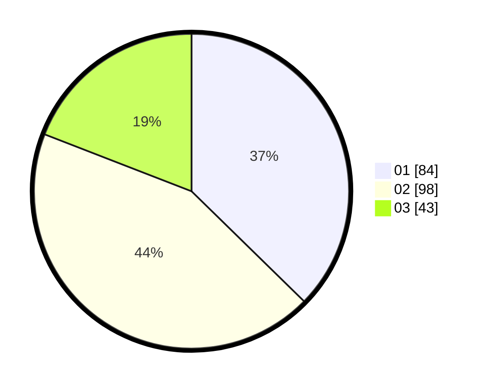

# Hasil

Hasil perolehan suara paslon dapat dilihat pada file paslon-01.txt, paslon-02.txt, dan paslon-03.txt.

Jika tidak ada, artinya data tersebut belum ada pada SIREKAP.

## Perolehan Suara

 * Paslon 01: **84**.
 * Paslon 02: **98**.
 * Paslon 03: **43**.

## Foto C Plano

https://sirekap-obj-formc.kpu.go.id/6c06/pemilu/ppwp/31/75/05/10/03/3175051003125-20240215-025926--1f56f554-4dd3-4b87-ad36-f4c250f56baf.jpg

https://sirekap-obj-formc.kpu.go.id/6c06/pemilu/ppwp/31/75/05/10/03/3175051003125-20240215-033017--83b16a77-94e8-44dc-8df6-8b26a983636b.jpg

https://sirekap-obj-formc.kpu.go.id/6c06/pemilu/ppwp/31/75/05/10/03/3175051003125-20240215-032342--8f1383e1-cbe0-4cfe-8ba9-1efcd2f98688.jpg
