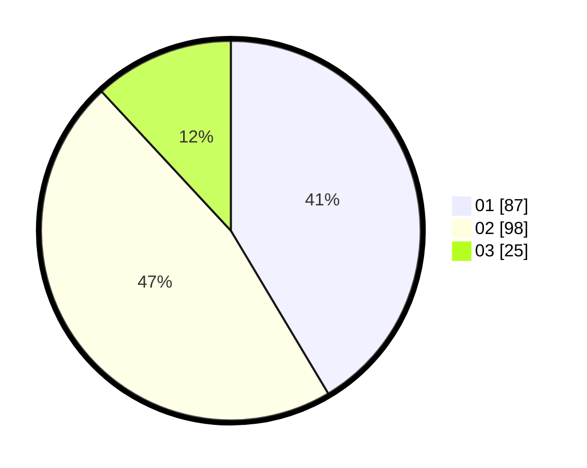

# Hasil

Hasil perolehan suara paslon dapat dilihat pada file paslon-01.txt, paslon-02.txt, dan paslon-03.txt.

Jika tidak ada, artinya data tersebut belum ada pada SIREKAP.

## Perolehan Suara

 * Paslon 01: **87**.
 * Paslon 02: **98**.
 * Paslon 03: **25**.

## Foto C Plano

https://sirekap-obj-formc.kpu.go.id/eca9/pemilu/ppwp/31/75/05/10/03/3175051003126-20240214-155218--3aace755-17f0-4f77-8cd1-9cc70b28968e.jpg

https://sirekap-obj-formc.kpu.go.id/eca9/pemilu/ppwp/31/75/05/10/03/3175051003126-20240214-155734--52393396-d554-4273-abcb-f45e3a55006f.jpg

https://sirekap-obj-formc.kpu.go.id/eca9/pemilu/ppwp/31/75/05/10/03/3175051003126-20240214-155129--e1edec80-a2ad-4421-a576-40e762d08575.jpg

## DATA PEMILIH TETAP

Jumlah pemilih dalam DPT: **259**.
 * L: **123**.
 * P: **136**.

## DATA PENGGUNA HAK PILIH

Jumlah pengguna hak pilih dalam DPT: **209**.
 * L: **97**.
 * P: **112**.

Jumlah pengguna hak pilih dalam DPTb: **0**.
 * L: **0**.
 * P: **0**.

Jumlah pengguna hak pilih dalam DPK: **2**.
 * L: **1**.
 * P: **1**.

Jumlah pengguna hak pilih: **211**.
 * L: **98**.
 * P: **113**.

## JUMLAH SUARA SAH DAN TIDAK SAH

JUMLAH SELURUH SUARA SAH: **210**.

JUMLAH SUARA TIDAK SAH: **1**.

JUMLAH SELURUH SUARA SAH DAN SUARA TIDAK SAH: **211**.
