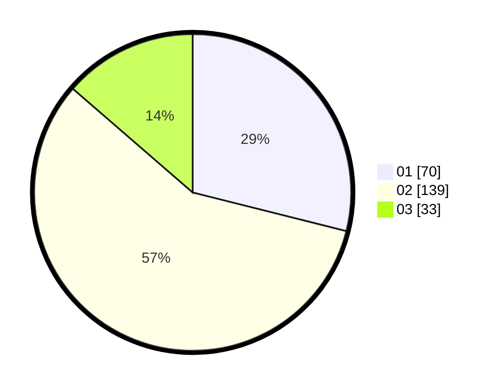

# Hasil

Hasil perolehan suara paslon dapat dilihat pada file paslon-01.txt, paslon-02.txt, dan paslon-03.txt.

Jika tidak ada, artinya data tersebut belum ada pada SIREKAP.

## Perolehan Suara

 * Paslon 01: **70**.
 * Paslon 02: **139**.
 * Paslon 03: **33**.

## Foto C Plano

https://sirekap-obj-formc.kpu.go.id/3ae4/pemilu/ppwp/31/75/05/10/03/3175051003127-20240214-211013--50f6d91c-89fa-4b0a-b1be-d12c4a1cf95f.jpg

https://sirekap-obj-formc.kpu.go.id/3ae4/pemilu/ppwp/31/75/05/10/03/3175051003127-20240214-211112--7976a800-a247-44fa-96b8-db5ebf3fc26c.jpg

https://sirekap-obj-formc.kpu.go.id/3ae4/pemilu/ppwp/31/75/05/10/03/3175051003127-20240214-211215--70e26353-c6e7-4b8e-8d58-7e3632f24086.jpg

## DATA PEMILIH TETAP

Jumlah pemilih dalam DPT: **275**.
 * L: **139**.
 * P: **136**.

## DATA PENGGUNA HAK PILIH

Jumlah pengguna hak pilih dalam DPT: **236**.
 * L: **117**.
 * P: **119**.

Jumlah pengguna hak pilih dalam DPTb: **1**.
 * L: **1**.
 * P: **0**.

Jumlah pengguna hak pilih dalam DPK: **8**.
 * L: **4**.
 * P: **4**.

Jumlah pengguna hak pilih: **245**.
 * L: **122**.
 * P: **123**.

## JUMLAH SUARA SAH DAN TIDAK SAH

JUMLAH SELURUH SUARA SAH: **242**.

JUMLAH SUARA TIDAK SAH: **3**.

JUMLAH SELURUH SUARA SAH DAN SUARA TIDAK SAH: **245**.
