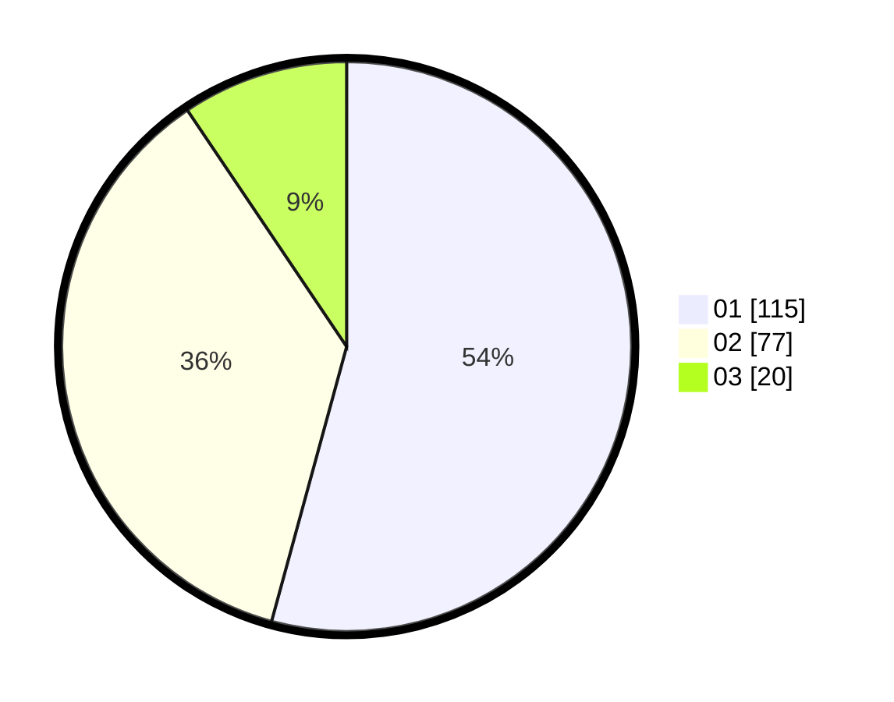

# Hasil

Hasil perolehan suara paslon dapat dilihat pada file paslon-01.txt, paslon-02.txt, dan paslon-03.txt.

Jika tidak ada, artinya data tersebut belum ada pada SIREKAP.

## Perolehan Suara

 * Paslon 01: **115**.
 * Paslon 02: **77**.
 * Paslon 03: **20**.

## Foto C Plano

https://sirekap-obj-formc.kpu.go.id/6394/pemilu/ppwp/31/75/05/10/03/3175051003134-20240214-205622--1f96583b-d1f7-42c5-b49a-720b3fe0e65f.jpg

https://sirekap-obj-formc.kpu.go.id/6394/pemilu/ppwp/31/75/05/10/03/3175051003134-20240214-191320--c76211d7-ccee-450e-9f8e-1be489cd3757.jpg

https://sirekap-obj-formc.kpu.go.id/6394/pemilu/ppwp/31/75/05/10/03/3175051003134-20240214-191331--02371cae-bf77-4691-801e-6bd96f5e2e2b.jpg

## DATA PEMILIH TETAP

Jumlah pemilih dalam DPT: **259**.
 * L: **123**.
 * P: **136**.

## DATA PENGGUNA HAK PILIH

Jumlah pengguna hak pilih dalam DPT: **204**.
 * L: **95**.
 * P: **109**.

Jumlah pengguna hak pilih dalam DPTb: **5**.
 * L: **2**.
 * P: **3**.

Jumlah pengguna hak pilih dalam DPK: **3**.
 * L: **1**.
 * P: **2**.

Jumlah pengguna hak pilih: **212**.
 * L: **98**.
 * P: **114**.

## JUMLAH SUARA SAH DAN TIDAK SAH

JUMLAH SELURUH SUARA SAH: **212**.

JUMLAH SUARA TIDAK SAH: **0**.

JUMLAH SELURUH SUARA SAH DAN SUARA TIDAK SAH: **212**.
