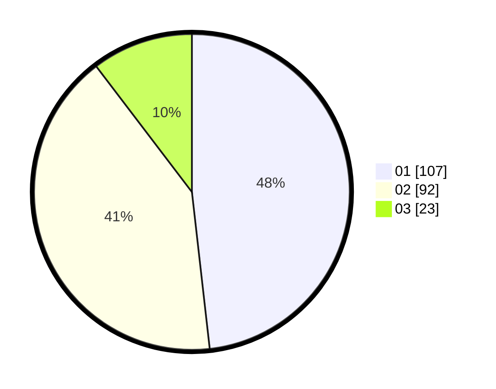

# Hasil

Hasil perolehan suara paslon dapat dilihat pada file paslon-01.txt, paslon-02.txt, dan paslon-03.txt.

Jika tidak ada, artinya data tersebut belum ada pada SIREKAP.

## Perolehan Suara

 * Paslon 01: **107**.
 * Paslon 02: **92**.
 * Paslon 03: **23**.

## Foto C Plano

https://sirekap-obj-formc.kpu.go.id/2b45/pemilu/ppwp/31/75/05/10/03/3175051003136-20240214-192914--78955cf4-15b1-40c3-a6aa-13f90b05851e.jpg

https://sirekap-obj-formc.kpu.go.id/2b45/pemilu/ppwp/31/75/05/10/03/3175051003136-20240214-192920--ae2748c7-aa52-42aa-817d-b2d3529f5bcc.jpg

https://sirekap-obj-formc.kpu.go.id/2b45/pemilu/ppwp/31/75/05/10/03/3175051003136-20240214-192924--01c5733a-e80d-4ffd-b038-1e0d5900a6aa.jpg

## DATA PEMILIH TETAP

Jumlah pemilih dalam DPT: **258**.
 * L: **130**.
 * P: **128**.

## DATA PENGGUNA HAK PILIH

Jumlah pengguna hak pilih dalam DPT: **222**.
 * L: **109**.
 * P: **113**.

Jumlah pengguna hak pilih dalam DPTb: **3**.
 * L: **0**.
 * P: **3**.

Jumlah pengguna hak pilih dalam DPK: **1**.
 * L: **0**.
 * P: **1**.

Jumlah pengguna hak pilih: **226**.
 * L: **109**.
 * P: **117**.

## JUMLAH SUARA SAH DAN TIDAK SAH

JUMLAH SELURUH SUARA SAH: **222**.

JUMLAH SUARA TIDAK SAH: **4**.

JUMLAH SELURUH SUARA SAH DAN SUARA TIDAK SAH: **226**.
