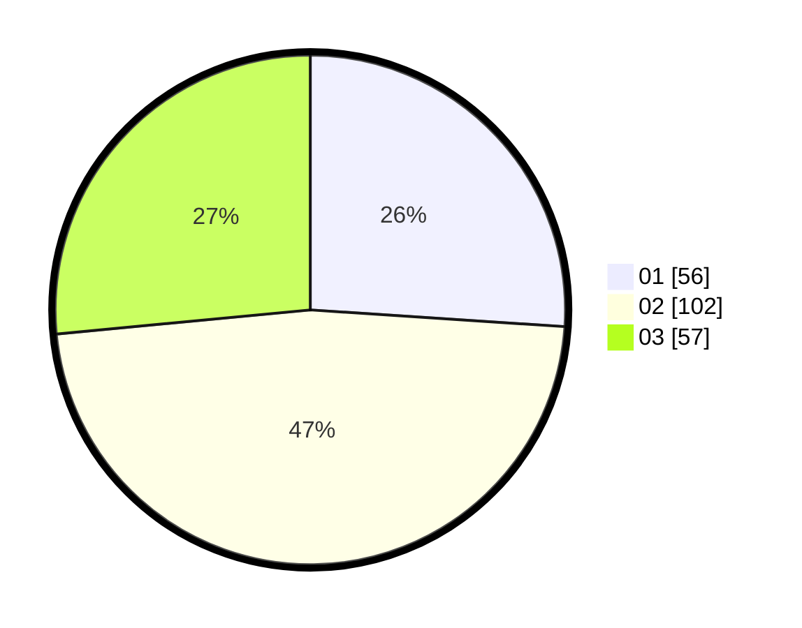

# Hasil

Hasil perolehan suara paslon dapat dilihat pada file paslon-01.txt, paslon-02.txt, dan paslon-03.txt.

Jika tidak ada, artinya data tersebut belum ada pada SIREKAP.

## Perolehan Suara

 * Paslon 01: **56**.
 * Paslon 02: **102**.
 * Paslon 03: **57**.

## Foto C Plano

https://sirekap-obj-formc.kpu.go.id/4bf0/pemilu/ppwp/31/75/05/10/03/3175051003140-20240214-232938--885ff66d-275c-479c-b2ad-3ba9b15fec40.jpg

https://sirekap-obj-formc.kpu.go.id/4bf0/pemilu/ppwp/31/75/05/10/03/3175051003140-20240214-233052--b86e90ab-8b0c-44be-bb58-7b6a255a9cb7.jpg

https://sirekap-obj-formc.kpu.go.id/4bf0/pemilu/ppwp/31/75/05/10/03/3175051003140-20240214-233119--f5169474-06da-45e5-9f2a-201de9d2d6c1.jpg
