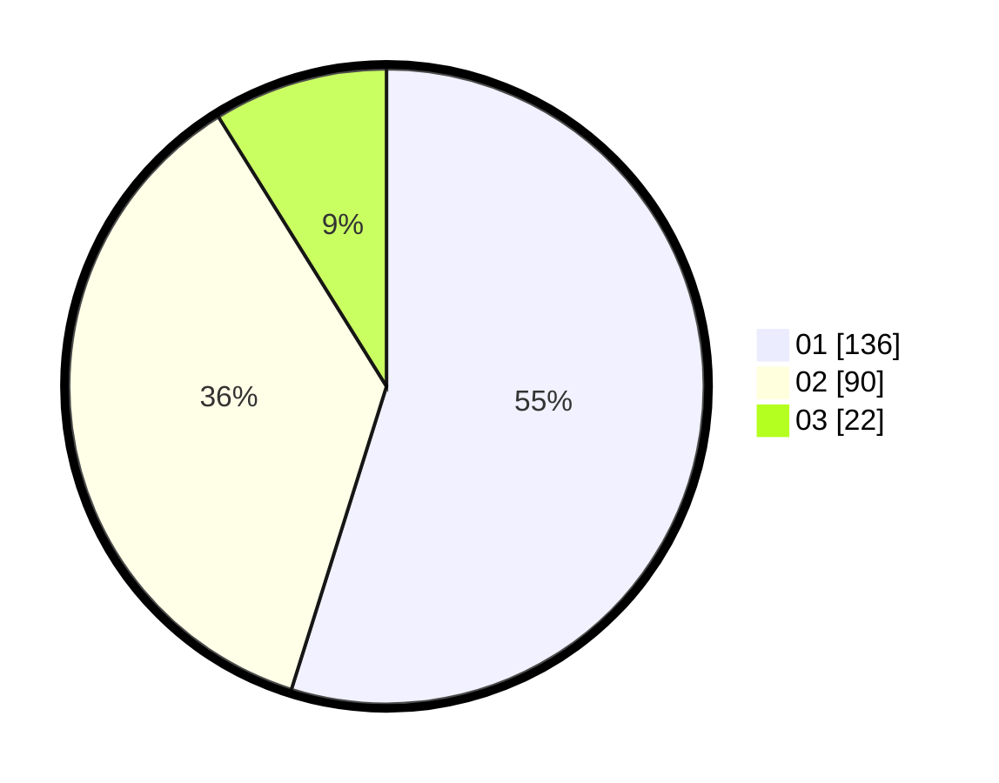

# Hasil

Hasil perolehan suara paslon dapat dilihat pada file paslon-01.txt, paslon-02.txt, dan paslon-03.txt.

Jika tidak ada, artinya data tersebut belum ada pada SIREKAP.

## Perolehan Suara

 * Paslon 01: **136**.
 * Paslon 02: **90**.
 * Paslon 03: **22**.

## Foto C Plano

https://sirekap-obj-formc.kpu.go.id/1ab0/pemilu/ppwp/31/75/05/10/04/3175051004010-20240214-220438--527b90f1-1887-47b7-8401-89effabe851b.jpg

https://sirekap-obj-formc.kpu.go.id/1ab0/pemilu/ppwp/31/75/05/10/04/3175051004010-20240214-220245--a2228dc8-6155-4d50-9163-7322e3011dcf.jpg

https://sirekap-obj-formc.kpu.go.id/1ab0/pemilu/ppwp/31/75/05/10/04/3175051004010-20240214-220206--c2483853-3bdd-4b9a-aad6-5bff31f31f0d.jpg

## DATA PEMILIH TETAP

Jumlah pemilih dalam DPT: **290**.
 * L: **142**.
 * P: **148**.

## DATA PENGGUNA HAK PILIH

Jumlah pengguna hak pilih dalam DPT: **236**.
 * L: **114**.
 * P: **122**.

Jumlah pengguna hak pilih dalam DPTb: **14**.
 * L: **12**.
 * P: **2**.

Jumlah pengguna hak pilih dalam DPK: **1**.
 * L: **1**.
 * P: **0**.

Jumlah pengguna hak pilih: **251**.
 * L: **127**.
 * P: **124**.

## JUMLAH SUARA SAH DAN TIDAK SAH

JUMLAH SELURUH SUARA SAH: **248**.

JUMLAH SUARA TIDAK SAH: **3**.

JUMLAH SELURUH SUARA SAH DAN SUARA TIDAK SAH: **251**.
