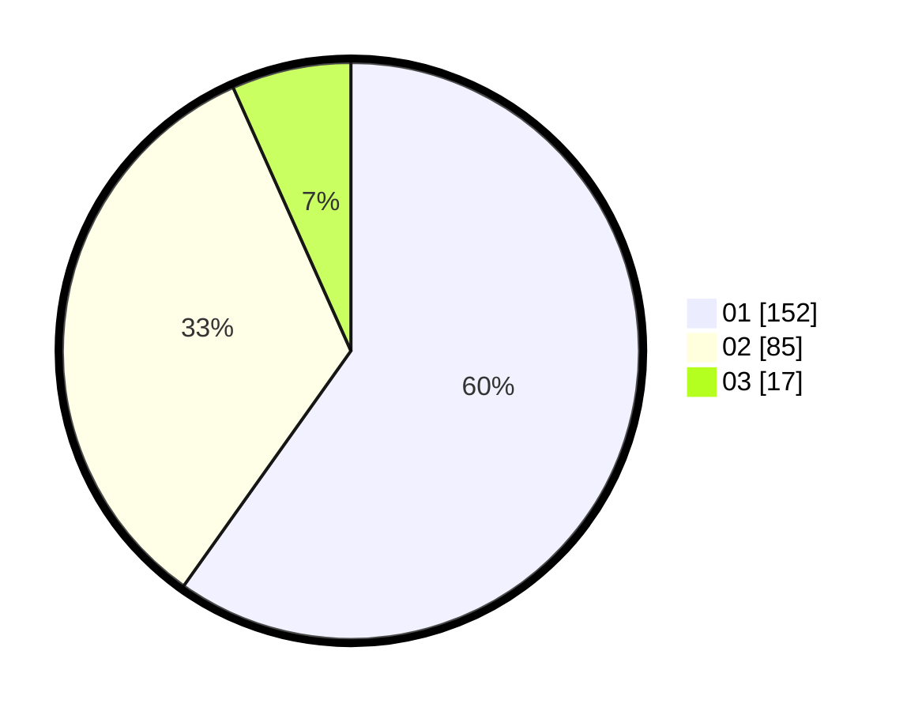

# Hasil

Hasil perolehan suara paslon dapat dilihat pada file paslon-01.txt, paslon-02.txt, dan paslon-03.txt.

Jika tidak ada, artinya data tersebut belum ada pada SIREKAP.

## Perolehan Suara

 * Paslon 01: **152**.
 * Paslon 02: **85**.
 * Paslon 03: **17**.

## Foto C Plano

https://sirekap-obj-formc.kpu.go.id/39d1/pemilu/ppwp/31/75/05/10/04/3175051004012-20240214-185641--b8bb937a-5353-4566-867c-446055a141b3.jpg

https://sirekap-obj-formc.kpu.go.id/39d1/pemilu/ppwp/31/75/05/10/04/3175051004012-20240214-185657--5bd80e38-5294-49af-8a88-44358a957110.jpg

https://sirekap-obj-formc.kpu.go.id/39d1/pemilu/ppwp/31/75/05/10/04/3175051004012-20240214-185706--4642fb9e-cd05-4306-af84-5f1e9c38e446.jpg

## DATA PEMILIH TETAP

Jumlah pemilih dalam DPT: **291**.
 * L: **145**.
 * P: **146**.

## DATA PENGGUNA HAK PILIH

Jumlah pengguna hak pilih dalam DPT: **246**.
 * L: **117**.
 * P: **129**.

Jumlah pengguna hak pilih dalam DPTb: **1**.
 * L: **0**.
 * P: **1**.

Jumlah pengguna hak pilih dalam DPK: **8**.
 * L: **3**.
 * P: **5**.

Jumlah pengguna hak pilih: **255**.
 * L: **120**.
 * P: **135**.

## JUMLAH SUARA SAH DAN TIDAK SAH

JUMLAH SELURUH SUARA SAH: **254**.

JUMLAH SUARA TIDAK SAH: **1**.

JUMLAH SELURUH SUARA SAH DAN SUARA TIDAK SAH: **255**.
