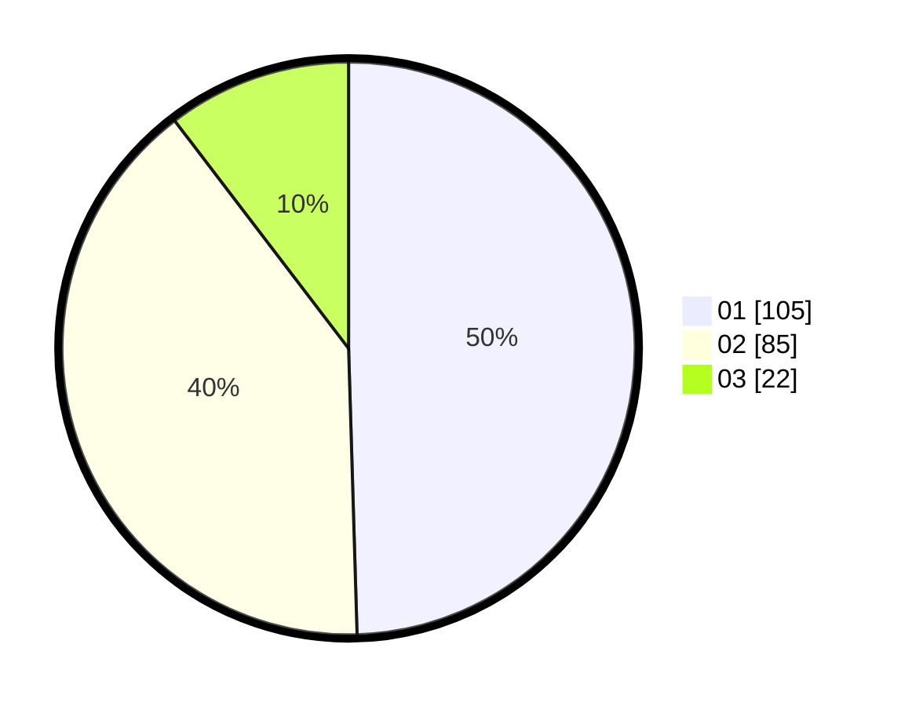

# Hasil

Hasil perolehan suara paslon dapat dilihat pada file paslon-01.txt, paslon-02.txt, dan paslon-03.txt.

Jika tidak ada, artinya data tersebut belum ada pada SIREKAP.

## Perolehan Suara

 * Paslon 01: **105**.
 * Paslon 02: **85**.
 * Paslon 03: **22**.

## Foto C Plano

https://sirekap-obj-formc.kpu.go.id/0398/pemilu/ppwp/31/75/05/10/04/3175051004016-20240214-224030--fd493938-0b89-4075-a04f-8cfc4c070756.jpg

https://sirekap-obj-formc.kpu.go.id/0398/pemilu/ppwp/31/75/05/10/04/3175051004016-20240214-224104--a014c884-6f54-4137-b234-fe0729f523f7.jpg

https://sirekap-obj-formc.kpu.go.id/0398/pemilu/ppwp/31/75/05/10/04/3175051004016-20240214-224158--efc2e1c1-201f-4b42-8c98-949196f8a8b7.jpg
