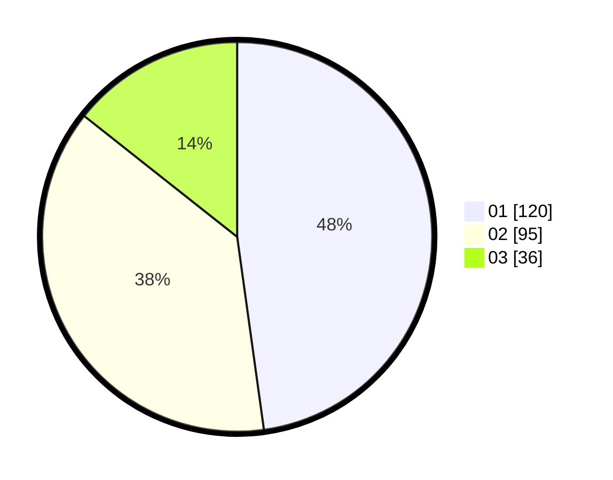

# Hasil

Hasil perolehan suara paslon dapat dilihat pada file paslon-01.txt, paslon-02.txt, dan paslon-03.txt.

Jika tidak ada, artinya data tersebut belum ada pada SIREKAP.

## Perolehan Suara

 * Paslon 01: **120**.
 * Paslon 02: **95**.
 * Paslon 03: **36**.

## Foto C Plano

https://sirekap-obj-formc.kpu.go.id/a5f6/pemilu/ppwp/31/75/05/10/04/3175051004018-20240214-233045--d0c58d93-51d0-47de-925b-5d7fe395ff41.jpg

https://sirekap-obj-formc.kpu.go.id/a5f6/pemilu/ppwp/31/75/05/10/04/3175051004018-20240214-233515--867948b5-5de2-4c96-b6e4-9aa24eb218cd.jpg

https://sirekap-obj-formc.kpu.go.id/a5f6/pemilu/ppwp/31/75/05/10/04/3175051004018-20240215-025955--8b716230-cef2-4fbc-8257-5b1750865a74.jpg

## DATA PEMILIH TETAP

Jumlah pemilih dalam DPT: **288**.
 * L: **164**.
 * P: **124**.

## DATA PENGGUNA HAK PILIH

Jumlah pengguna hak pilih dalam DPT: **253**.
 * L: **135**.
 * P: **118**.

Jumlah pengguna hak pilih dalam DPTb: **1**.
 * L: **0**.
 * P: **1**.

Jumlah pengguna hak pilih dalam DPK: **1**.
 * L: **1**.
 * P: **0**.

Jumlah pengguna hak pilih: **255**.
 * L: **136**.
 * P: **119**.

## JUMLAH SUARA SAH DAN TIDAK SAH

JUMLAH SELURUH SUARA SAH: **251**.

JUMLAH SUARA TIDAK SAH: **4**.

JUMLAH SELURUH SUARA SAH DAN SUARA TIDAK SAH: **255**.
