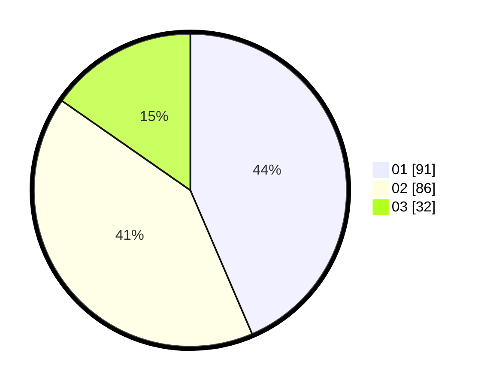

# Hasil

Hasil perolehan suara paslon dapat dilihat pada file paslon-01.txt, paslon-02.txt, dan paslon-03.txt.

Jika tidak ada, artinya data tersebut belum ada pada SIREKAP.

## Perolehan Suara

 * Paslon 01: **91**.
 * Paslon 02: **86**.
 * Paslon 03: **32**.

## Foto C Plano

https://sirekap-obj-formc.kpu.go.id/71fe/pemilu/ppwp/31/75/05/10/04/3175051004023-20240216-063835--d14448b3-e7f6-4e70-b4df-05fa64d8ea79.jpg

https://sirekap-obj-formc.kpu.go.id/71fe/pemilu/ppwp/31/75/05/10/04/3175051004023-20240214-155408--148585e5-0c44-4c24-957f-c858aeaf9a77.jpg

https://sirekap-obj-formc.kpu.go.id/71fe/pemilu/ppwp/31/75/05/10/04/3175051004023-20240214-155517--3fa8f4cb-8e60-44f1-8f3e-7d11ad8b848e.jpg

## DATA PEMILIH TETAP

Jumlah pemilih dalam DPT: **266**.
 * L: **127**.
 * P: **139**.

## DATA PENGGUNA HAK PILIH

Jumlah pengguna hak pilih dalam DPT: **195**.
 * L: **87**.
 * P: **108**.

Jumlah pengguna hak pilih dalam DPTb: **6**.
 * L: **4**.
 * P: **2**.

Jumlah pengguna hak pilih dalam DPK: **11**.
 * L: **5**.
 * P: **6**.

Jumlah pengguna hak pilih: **212**.
 * L: **96**.
 * P: **116**.

## JUMLAH SUARA SAH DAN TIDAK SAH

JUMLAH SELURUH SUARA SAH: **209**.

JUMLAH SUARA TIDAK SAH: **3**.

JUMLAH SELURUH SUARA SAH DAN SUARA TIDAK SAH: **212**.
