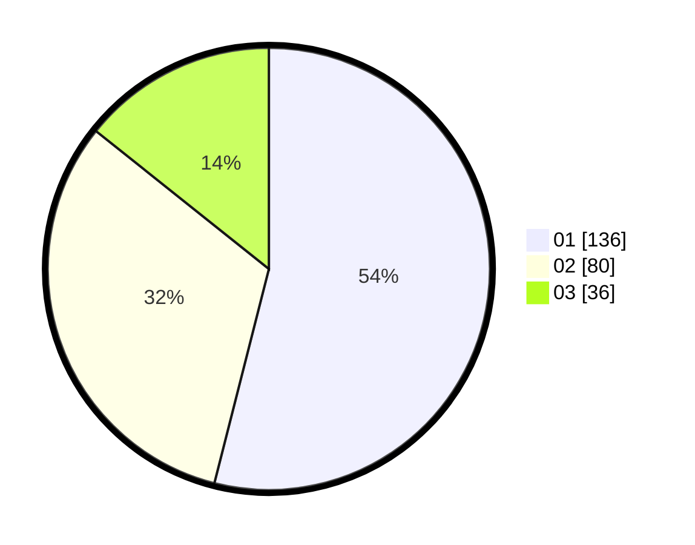

# Hasil

Hasil perolehan suara paslon dapat dilihat pada file paslon-01.txt, paslon-02.txt, dan paslon-03.txt.

Jika tidak ada, artinya data tersebut belum ada pada SIREKAP.

## Perolehan Suara

 * Paslon 01: **136**.
 * Paslon 02: **80**.
 * Paslon 03: **36**.

## Foto C Plano

https://sirekap-obj-formc.kpu.go.id/dd51/pemilu/ppwp/31/75/05/10/04/3175051004032-20240214-204135--1d90e84e-c6d5-4de4-8c8f-4963dbbb1e3c.jpg

https://sirekap-obj-formc.kpu.go.id/dd51/pemilu/ppwp/31/75/05/10/04/3175051004032-20240214-204429--47ee8bb7-a8c8-40d7-a9e6-a7c2278fd194.jpg

https://sirekap-obj-formc.kpu.go.id/dd51/pemilu/ppwp/31/75/05/10/04/3175051004032-20240214-204528--063c8334-106f-4f6a-8fa8-4318c8a688da.jpg

## DATA PEMILIH TETAP

Jumlah pemilih dalam DPT: **294**.
 * L: **151**.
 * P: **143**.

## DATA PENGGUNA HAK PILIH

Jumlah pengguna hak pilih dalam DPT: **249**.
 * L: **124**.
 * P: **125**.

Jumlah pengguna hak pilih dalam DPTb: **4**.
 * L: **1**.
 * P: **3**.

Jumlah pengguna hak pilih dalam DPK: **1**.
 * L: **0**.
 * P: **1**.

Jumlah pengguna hak pilih: **254**.
 * L: **125**.
 * P: **129**.

## JUMLAH SUARA SAH DAN TIDAK SAH

JUMLAH SELURUH SUARA SAH: **252**.

JUMLAH SUARA TIDAK SAH: **2**.

JUMLAH SELURUH SUARA SAH DAN SUARA TIDAK SAH: **254**.
