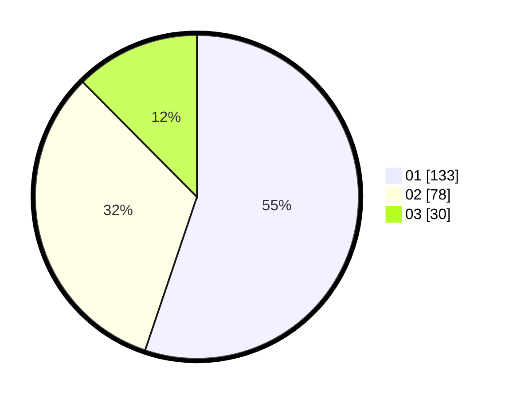

# Hasil

Hasil perolehan suara paslon dapat dilihat pada file paslon-01.txt, paslon-02.txt, dan paslon-03.txt.

Jika tidak ada, artinya data tersebut belum ada pada SIREKAP.

## Perolehan Suara

 * Paslon 01: **133**.
 * Paslon 02: **78**.
 * Paslon 03: **30**.

## Foto C Plano

https://sirekap-obj-formc.kpu.go.id/1176/pemilu/ppwp/31/75/05/10/04/3175051004033-20240214-205646--9574eec8-c61f-4ea0-9ee8-56912f455bca.jpg

https://sirekap-obj-formc.kpu.go.id/1176/pemilu/ppwp/31/75/05/10/04/3175051004033-20240214-205705--700680ea-758b-4148-ba7f-a69f32857026.jpg

https://sirekap-obj-formc.kpu.go.id/1176/pemilu/ppwp/31/75/05/10/04/3175051004033-20240214-205723--214c23a4-6e3a-41c7-8f04-38179aef2516.jpg

## DATA PEMILIH TETAP

Jumlah pemilih dalam DPT: **287**.
 * L: **131**.
 * P: **156**.

## DATA PENGGUNA HAK PILIH

Jumlah pengguna hak pilih dalam DPT: **240**.
 * L: **105**.
 * P: **135**.

Jumlah pengguna hak pilih dalam DPTb: **3**.
 * L: **2**.
 * P: **1**.

Jumlah pengguna hak pilih dalam DPK: **0**.
 * L: **0**.
 * P: **0**.

Jumlah pengguna hak pilih: **243**.
 * L: **107**.
 * P: **136**.

## JUMLAH SUARA SAH DAN TIDAK SAH

JUMLAH SELURUH SUARA SAH: **241**.

JUMLAH SUARA TIDAK SAH: **2**.

JUMLAH SELURUH SUARA SAH DAN SUARA TIDAK SAH: **243**.
